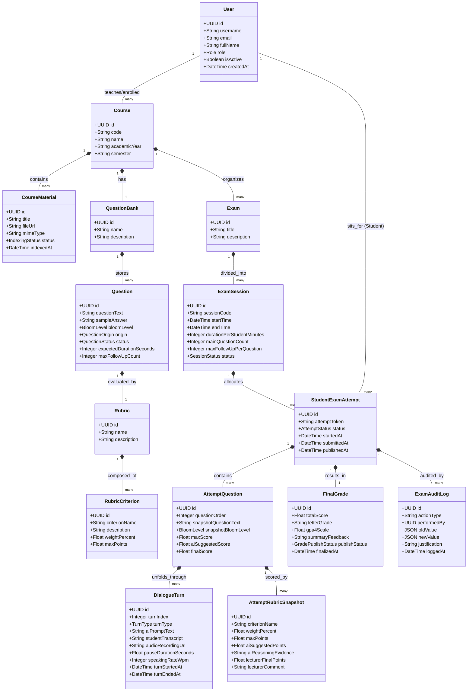

# AIVES (AI-powered Viva Exam System)
## Mô Hình Miền & Các Bất Biến Nghiệp Vụ (Domain Model)
**Mã tài liệu:** `AIVES-DOC-03-DM`

---

## 1. Giới Thiệu & Triết Lý Thiết Kế Mô Hình Miền

Mô hình miền (Domain Model) của hệ thống **AIVES** được thiết kế nhằm mô hình hóa chính xác các thực thể thực tế trong một kỳ thi vấn đáp đại học, đồng thời giải quyết bài toán cốt lõi: **Bảo tồn tính toàn vẹn học thuật và lịch sử bất biến của các kỳ thi**.

### Các nguyên tắc thiết kế then chốt:
1. **Bất biến lịch sử (Historical Immutability via Snapshots):** Khi sinh viên thực hiện bài thi, câu hỏi và tiêu chí rubric được gán vào bài thi dưới dạng bản sao thời điểm (`Snapshot`). Mọi thay đổi về sau trong ngân hàng câu hỏi gốc của giảng viên tuyệt đối không làm sai lệch căn cứ chấm điểm của các bài thi đã hoàn thành.
2. **Phân định rõ ràng giữa Đề xuất của AI và Quyết định của Con người:** Tách biệt rõ thực thể `AIScoreSuggestion` (gợi ý) và `LecturerEvaluation` (quyết định của giảng viên), tạo thành thực thể hợp nhất `FinalGrade`.
3. **Cấu trúc Lượt thoại phân cấp (Hierarchical Dialogue Turns):** Một phiên thi (`ExamAttempt`) gồm nhiều câu hỏi chính (`AttemptQuestion`), mỗi câu hỏi chính lại chứa một chuỗi các lượt hỏi - đáp (`DialogueTurn`) bao gồm câu hỏi chính và các câu hỏi đào sâu thích ứng (`Adaptive Follow-up`).

---

## 2. Sơ Đồ Thực Thể Mô Hình Miền (Domain Class Diagram)

---

## 3. Đặc Tả Chi Tiết Các Thực Thể Miền (Entity Responsibilities & Attributes)

### 3.1. Phân hệ Người dùng & Môn học (Identity & Academic Scope)

#### 1. `User`
- **Trách nhiệm:** Đại diện cho con người tương tác với hệ thống (Giảng viên, Sinh viên, Quản trị viên).
- **Thuộc tính chính:**
  - `id`: UUID (Khóa chính).
  - `username`: Tên đăng nhập (Mã số sinh viên hoặc Mã giảng viên).
  - `email`: Địa chỉ email trường học.
  - `fullName`: Họ và tên đầy đủ.
  - `role`: Enum (`ADMIN`, `LECTURER`, `STUDENT`).
  - `isActive`: Trạng thái hoạt động tài khoản.

#### 2. `Course`
- **Trách nhiệm:** Đại diện cho một môn học / học phần trong chương trình đào tạo.
- **Thuộc tính chính:**
  - `code`: Mã môn học (ví dụ: `IT001`, `SE305`).
  - `name`: Tên môn học (ví dụ: *Lập trình Hướng đối tượng*).
  - `academicYear`: Niên khóa (ví dụ: `2025-2026`).
  - `semester`: Học kỳ (ví dụ: `HK1`).

#### 3. `CourseMaterial`
- **Trách nhiệm:** Lưu trữ tài liệu học tập phục vụ RAG (slide bài giảng, giáo trình PDF/DOCX).
- **Thuộc tính chính:**
  - `title`: Tiêu đề tài liệu.
  - `fileUrl`: Đường dẫn lưu trữ tệp trên Object Storage.
  - `mimeType`: Định dạng tệp (`application/pdf`, `application/vnd.openxmlformats-officedocument.wordprocessingml.document`).
  - `status`: Enum (`PENDING_INDEX`, `INDEXING`, `INDEXED`, `FAILED`).
  - `vectorNamespace`: Không gian định danh trong Vector Database phục vụ truy vấn ngữ nghĩa.

---

### 3.2. Phân hệ Ngân hàng Câu hỏi & Rubric (Question & Rubric Catalog)

#### 4. `Question`
- **Trách nhiệm:** Câu hỏi vấn đáp mẫu được lưu trữ trong ngân hàng đề.
- **Thuộc tính chính:**
  - `questionText`: Nội dung câu hỏi chính.
  - `sampleAnswer`: Gợi ý câu trả lời chuẩn / các ý chính cần đạt.
  - `bloomLevel`: Enum (`REMEMBER`, `UNDERSTAND`, `APPLY`, `ANALYZE`).
  - `origin`: Enum (`MANUAL`, `IMPORTED`, `AI_RAG`).
  - `status`: Enum (`PENDING_REVIEW`, `APPROVED`, `REJECTED`, `ARCHIVED`).
  - `expectedDurationSeconds`: Thời lượng dự kiến cho câu hỏi (ví dụ: 180s).
  - `maxFollowUpCount`: Giới hạn lượt hỏi xoáy tối đa (mặc định: 1 - 2).

#### 5. `Rubric` & `RubricCriterion`
- **Trách nhiệm:** Tiêu chuẩn hóa barem chấm điểm đa chiều cho câu hỏi vấn đáp.
- **Thuộc tính chính của `RubricCriterion`:**
  - `criterionName`: Tên tiêu chí (ví dụ: *Độ chính xác khái niệm*, *Khả năng phản biện khi hỏi xoáy*).
  - `description`: Mô tả chi tiết mức độ đạt được của tiêu chí.
  - `weightPercent`: Tỷ trọng điểm phần trăm (0 - 100%).
  - `maxPoints`: Điểm số tối đa của tiêu chí này (ví dụ: 2.0).

---

### 3.3. Phân hệ Kỳ thi & Lịch thi (Exam & Session Management)

#### 6. `Exam` & `ExamSession`
- **Trách nhiệm:** Xác lập kỳ thi và phân chia thành các ca thi cụ thể theo phòng/khung giờ.
- **Thuộc tính chính của `ExamSession`:**
  - `sessionCode`: Mã ca thi (ví dụ: `VIVA-OOP-CA1-2026`).
  - `startTime`: Thời điểm mở ca thi.
  - `endTime`: Thời điểm đóng ca thi.
  - `durationPerStudentMinutes`: Thời gian làm bài tối đa của mỗi sinh viên (ví dụ: 15 phút).
  - `mainQuestionCount`: Số lượng câu hỏi chính mỗi sinh viên phải thi.
  - `status`: Enum (`SCHEDULED`, `RUNNING`, `COMPLETED`, `CLOSED`).

---

### 3.4. Phân hệ Bài thi & Tương tác Lõi AI (Attempt, Dialogue & Evaluation)

#### 7. `StudentExamAttempt`
- **Trách nhiệm:** Thực thể trung tâm lưu trữ toàn bộ trạng thái và kết quả của một sinh viên trong một ca thi cụ thể.
- **Vòng đời trạng thái (Lifecycle):**
  `SCHEDULED` $\rightarrow$ `IN_PROGRESS` $\rightarrow$ `SUBMITTED` $\rightarrow$ `AI_SUGGESTED` $\rightarrow$ `IN_REVIEW` $\rightarrow$ `FINALIZED` $\rightarrow$ `PUBLISHED` (và nhánh `APPEALED`).

#### 8. `AttemptQuestion` (Snapshot Câu hỏi)
- **Trách nhiệm:** Bản sao bất biến của câu hỏi tại thời điểm sinh viên bốc đề.
- **Thuộc tính chính:**
  - `snapshotQuestionText`: Lưu nguyên văn câu hỏi lúc thi (tránh việc sửa ngân hàng làm đổi đề cũ).
  - `snapshotBloomLevel`: Cấp độ Bloom lúc thi.
  - `maxScore`: Điểm tối đa của câu hỏi này.
  - `aiSuggestedScore`: Điểm tổng do AI gợi ý cho câu này.
  - `finalScore`: Điểm tổng do giảng viên chốt cho câu này.

#### 9. `DialogueTurn` (Lượt đối thoại âm thanh & văn bản)
- **Trách nhiệm:** Bản ghi chi tiết của từng lượt tương tác hỏi - đáp giữa Giám khảo AI và Sinh viên.
- **Thuộc tính chính:**
  - `turnIndex`: Thứ tự lượt nói trong câu hỏi (0: Câu hỏi chính; 1, 2: Câu hỏi đào sâu).
  - `turnType`: Enum (`MAIN_QUESTION`, `ADAPTIVE_FOLLOW_UP`).
  - `aiPromptText`: Văn bản câu hỏi AI đã nói.
  - `studentTranscript`: Văn bản bóc băng lời trả lời của sinh viên.
  - `audioRecordingUrl`: Đường dẫn lưu trữ file ghi âm đoạn nói này trên Object Storage.
  - `pauseDurationSeconds`: Thời gian ngập ngừng/khoảng lặng của sinh viên.
  - `speakingRateWpm`: Tốc độ nói (từ/phút - tín hiệu phụ trợ độ trôi chảy).

#### 10. `AttemptRubricSnapshot` (Đánh giá tiêu chí & Bằng chứng)
- **Trách nhiệm:** Kết quả đánh giá trên từng tiêu chí Rubric của câu hỏi.
- **Thuộc tính chính:**
  - `criterionName`: Tên tiêu chí.
  - `weightPercent`: Tỷ trọng %.
  - `maxPoints`: Điểm tối đa.
  - `aiSuggestedPoints`: Điểm số do AI đề xuất.
  - `aiReasoningEvidence`: Lời giải thích và trích dẫn câu nói của sinh viên do AI đưa ra làm bằng chứng.
  - `lecturerFinalPoints`: Điểm số do giảng viên chốt cuối cùng.
  - `lecturerComment`: Ghi chú nhận xét riêng của giảng viên.

#### 11. `FinalGrade`
- **Trách nhiệm:** Kết quả điểm số chính thức và nhận xét tổng kết toàn bài thi.
- **Thuộc tính chính:**
  - `totalScore`: Tổng điểm chính thức (thang 10).
  - `letterGrade`: Điểm chữ quy đổi (`A`, `B+`, `B`, `C+`, `C`, `D+`, `D`, `F`).
  - `gpa4Scale`: Điểm quy đổi thang 4.0.
  - `summaryFeedback`: Báo cáo nhận xét tổng quan (Điểm mạnh, Lỗ hổng kiến thức, Lời khuyên ôn tập).
  - `publishStatus`: Enum (`DRAFT`, `PUBLISHED`).
  - `finalizedAt`: Dấu thời gian giảng viên chốt điểm.

#### 12. `ExamAuditLog`
- **Trách nhiệm:** Lưu vết bất biến mọi hành động nhạy cảm (sửa điểm, thay đổi trạng thái, phúc khảo).
- **Thuộc tính chính:**
  - `actionType`: Enum (`GRADE_OVERRIDE`, `STATUS_CHANGE`, `APPEAL_SUBMITTED`, `APPEAL_RESOLVED`).
  - `performedBy`: ID người thực hiện hành động.
  - `oldValue`: Giá trị cũ (JSON).
  - `newValue`: Giá trị mới (JSON).
  - `justification`: Lý do điều chỉnh của giảng viên.
  - `loggedAt`: Dấu thời gian chuẩn UTC.

---

## 4. Các Bất Biến Nghiệp Vụ Cốt Lõi (Business Invariants)

Các bất biến nghiệp vụ là những quy tắc mà mô hình miền **bắt buộc phải bảo đảm luôn luôn đúng** trong mọi hoàn cảnh:

- **INV-1 (Bất biến Rubric 100%):** Với mỗi `Question`, tổng trọng số `weightPercent` của toàn bộ các `RubricCriterion` trực thuộc bắt buộc phải luôn luôn bằng chính xác $100\%$:
  $$\sum \text{RubricCriterion.weightPercent} = 100.0$$
- **INV-2 (Giới hạn Điểm số Thành phần):** Điểm số đạt được của một tiêu chí Rubric (cả `aiSuggestedPoints` và `lecturerFinalPoints`) không bao giờ được phép âm và không bao giờ vượt quá điểm trần `maxPoints` của tiêu chí đó:
  $$0 \le \text{points} \le \text{maxPoints}$$
- **INV-3 (Bất biến Phê duyệt Câu hỏi - Approval Invariant):** Một `Question` có nguồn gốc từ AI (`origin = AI_RAG`) chỉ được phép đưa vào ca thi khi thuộc tính `status = APPROVED`.
- **INV-4 (Bất biến Điểm Chính thức - Authority Invariant):** Không có bất kỳ thực thể `FinalGrade` nào được phép có trạng thái `publishStatus = PUBLISHED` nếu thiếu định danh xác nhận `lecturer_id` của Giảng viên.
- **INV-5 (Bất biến Bất khả xâm phạm của Transcript - Trace Immutability):** Khi một `StudentExamAttempt` chuyển sang trạng thái `SUBMITTED`, toàn bộ các thực thể `DialogueTurn` trực thuộc sẽ bị khóa vĩnh viễn ở chế độ Chỉ đọc (Read-only); không phương thức nào trong hệ thống được phép sửa đổi `studentTranscript` hoặc `audioRecordingUrl`.
- **INV-6 (Giới hạn Lượt hỏi xoáy - Turn Boundary Invariant):** Số lượng các bản ghi `DialogueTurn` có kiểu `turnType = ADAPTIVE_FOLLOW_UP` trong một `AttemptQuestion` không bao giờ được vượt quá giá trị `maxFollowUpCount` đã được cấu hình.
