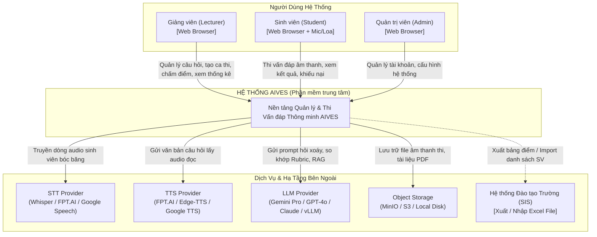

# AIVES (AI-powered Viva Exam System)
## Tài Liệu Thiết Kế Kiến Trúc Hệ Thống (C4 Architecture & ADRs)
**Mã tài liệu:** `AIVES-DOC-04-ARCH`

---

## 1. Triết Lý & Nguyên Tắc Kiến Trúc (Architecture Principles)

Để đáp ứng các yêu cầu khắt khe về độ trễ hội thoại thời gian thực, độ tin cậy của kỳ thi học thuật và không gây quá tải vận hành cho đồ án nhóm đại học, kiến trúc của AIVES tuân thủ 4 nguyên tắc:

1. **Bắt đầu từ sự đơn giản (Start with Simplicity - No Unnecessary Microservices):**
   - Tránh việc phân mảnh hệ thống thành hàng chục microservices phức tạp gây phân tán dữ liệu và khó khăn khi triển khai.
   - Lựa chọn mô hình **Modular Monolith** (Đơn khối module hóa cao) kết hợp với **Hàng đợi tác vụ bất đồng bộ (Asynchronous Worker)** cho các tác vụ nặng của AI (RAG chunking, video/audio processing).
2. **Tách biệt luồng Thời gian thực và luồng Nghiệp vụ (Real-time vs Business Segregation):**
   - Luồng hội thoại viva (truyền nhận âm thanh, VAD, STT streaming) được tối ưu qua kênh **WebSocket 2 chiều**, không làm nghẽn các API nghiệp vụ CRUD thông thường.
3. **Cơ chế Dự phòng Không mất dữ liệu (Fail-Safe & Graceful Degradation):**
   - Sự cố ở các dịch vụ AI bên ngoài (LLM timeout, STT delay) phải được bao bọc bởi Circuit Breaker và cơ chế lưu trữ đệm; dữ liệu bài thi của sinh viên không bao giờ bị mất giữa chừng.
4. **Trừu tượng hóa nhà cung cấp AI (Provider Agnostic):**
   - Toàn bộ việc kết nối với các mô hình STT, TTS, LLM đều thông qua các cổng giao tiếp trừu tượng (Adapter Pattern), cho phép chuyển đổi linh hoạt giữa Cloud API (OpenAI, Google Gemini, FPT.AI) và các mô hình Local tự lưu trữ (Faster-Whisper, vLLM).

---

## 2. Mô Hình Kiến Trúc C4 (C4 Architecture Model)

### 2.1. C1: Biểu Đồ Ngữ Cảnh Hệ Thống (System Context Diagram)

Biểu đồ C1 mô tả ranh giới hệ thống AIVES và cách các tác tử bên ngoài tương tác với hệ thống:



---

### 2.2. C2: Biểu Đồ Thùng Chứa (Container Diagram)

Biểu đồ C2 bóc tách hệ thống AIVES thành các ứng dụng và kho lưu trữ dữ liệu cụ thể:

```mermaid
flowchart TB
    subgraph ClientTier["Tầng Giao Diện Người Dùng (Client Tier)"]
        WebSPA["AIVES Web Application (SPA)\n[Next.js / React + TailwindCSS]\n- Giao diện Giảng viên & Admin (Dashboard, Rubric Review)\n- Giao diện Sinh viên (Phòng thi Viva Audio, Báo cáo)"]
    end

    subgraph AppTier["Tầng Ứng Dụng & Điều Phối (Application Tier)"]
        APIGateway["Reverse Proxy / API Gateway\n[Nginx / Traefik]\n- SSL Termination, Rate Limiting, Routing"]
        
        MonolithBackend["AIVES Core Backend (Modular Monolith)\n[FastAPI / Python hoặc NestJS / Node.js]\n- Auth & RBAC Module\n- Question Bank & Rubric Module\n- Exam & Session Management\n- Reporting & Analytics Engine"]
        
        VivaWorker["AI Viva Orchestration Engine\n[Python Async Service / WebSockets]\n- Voice Activity Detection (VAD)\n- Real-time Audio Stream Handler\n- Adaptive Follow-up State Machine\n- Rubric Scoring Evaluator"]
        
        TaskQueue["Message Broker / Task Queue\n[Redis / Celery]\n- Xử lý băm nhỏ tài liệu RAG bất đồng bộ\n- Tổng hợp báo cáo thống kê lớp học"]
    end

    subgraph DataTier["Tầng Dữ Liệu & Lưu Trữ (Data Tier)"]
        RelationalDB[("Primary Database\n[PostgreSQL 16 + pgvector]\n- Dữ liệu người dùng, kỳ thi, bài thi\n- Snapshot câu hỏi & rubric\n- Vector Embeddings cho RAG tài liệu\n- Audit Logs")]
        
        ObjectStore[("Object Storage\n[MinIO / AWS S3]\n- Tệp slide/giáo trình môn học\n- Tệp ghi âm âm thanh (.mp3/webm)")]
        
        CacheStore[("In-Memory Cache\n[Redis]\n- Phiên thi đang chạy (Session States)\n- Rate Limiting, Temp Transcripts")]
    end

    WebSPA -->|HTTPS / REST API| APIGateway
    WebSPA -->|WSS / WebSockets (Voice Streaming)| APIGateway
    
    APIGateway -->|REST API| MonolithBackend
    APIGateway -->|WebSocket Tunnel| VivaWorker
    
    MonolithBackend -->|Đọc / Ghi nghiệp vụ| RelationalDB
    MonolithBackend -->|Đẩy tác vụ nền| TaskQueue
    MonolithBackend -->|Upload tài liệu| ObjectStore
    
    VivaWorker -->|Lưu vết Transcript & Điểm gợi ý| RelationalDB
    VivaWorker -->|Lưu file audio từng lượt nói| ObjectStore
    VivaWorker -->|Cập nhật trạng thái phiên| CacheStore
    
    TaskQueue -->|Tiến trình Worker xử lý RAG & Export| RelationalDB
```

---

## 3. Kiến Trúc Các Phân Hệ Cốt Lõi (Core Subsystem Architecture)

### 3.1. Phân hệ Lõi Vấn Đáp AI (AI Viva Orchestration Engine)
Đây là trái tim của hệ thống AIVES, chịu trách nhiệm duy trì nhịp đối thoại tự nhiên:
- **Quản lý phiên tương tác qua WebSocket:** Client của sinh viên mở kết nối WebSocket liên tục trong suốt buổi thi. Âm thanh được truyền tải dưới dạng các gói nhị phân (Binary Audio Chunks, chuẩn PCM 16kHz hoặc Opus).
- **Trình điều khiển VAD (Voice Activity Detection):**
  - Sử dụng thuật toán WebRTC-VAD hoặc Silero-VAD chạy trực tiếp trên luồng stream để phát hiện trạng thái: `SPEECH_START` $\rightarrow$ `SPEECH_ONGOING` $\rightarrow$ `SPEECH_END`.
  - Giảm thiểu việc gửi các đoạn âm thanh rác/tiếng ồn tới STT.
- **Máy trạng thái Lượt hỏi đáp (Dialogue State Machine):**
  - Quản lý chuyển dịch trạng thái của một câu hỏi:
    $$\text{AI\_SPEAKING} \xrightarrow{\text{TTS done}} \text{LISTENING} \xrightarrow{\text{VAD silence > 3s}} \text{TRANSCRIBING} \xrightarrow{\text{STT ready}} \text{EVALUATING\_FOLLOWUP} \xrightarrow{\text{Decision}} \begin{cases} \text{AI\_SPEAKING (Hỏi xoáy)} \\ \text{NEXT\_QUESTION} \end{cases}$$

### 3.2. Phân hệ RAG & Ngân hàng Câu hỏi (RAG & Knowledge Retrieval)
- **Xử lý tài liệu (Document Ingestion):**
  - Tài liệu bài giảng (PDF, PPTX) được bóc tách văn bản qua thư viện `PyMuPDF` hoặc `unstructured`.
  - Kỹ thuật phân đoạn (Chunking): Kích thước đoạn 500–800 tokens, độ gối đầu (overlap) 100 tokens.
- **Lưu trữ & Truy vấn Vector:**
  - Tận dụng tiện ích mở rộng **`pgvector` trực tiếp trong PostgreSQL** để lưu vector embeddings. Điều này loại bỏ hoàn toàn nhu cầu phải cài đặt và vận hành một cụm Vector DB riêng biệt (như Pinecone, Milvus hay Qdrant), giúp tiết kiệm tài nguyên và đồng bộ hóa transaction dữ liệu dễ dàng.
  - Sử dụng mô hình embedding hỗ trợ tiếng Việt tốt (như `text-embedding-3-small` hoặc `bge-m3`).

---

## 4. Các Bản Ghi Quyết Định Kiến Trúc (Architecture Decision Records - ADRs)

Dưới đây là 6 quyết định kỹ thuật nền tảng đã được cân nhắc kỹ lưỡng:

---

### ADR-01: Lựa chọn Phong cách Kiến trúc — Modular Monolith thay vì Microservices
- **Bối cảnh:** Dự án cần phát triển nhanh trong môi trường học thuật/nhóm sinh viên, hỗ trợ 7 nhóm tính năng với dữ liệu có tính toàn vẹn liên kết cao.
- **Các phương án cân nhắc:**
  1. *Microservices:* Tách riêng User Service, Exam Service, AI Service, Report Service.
  2. *Modular Monolith:* Gom toàn bộ vào một codebase có cấu trúc module độc lập cao (Clean/Hexagonal Architecture), kèm một worker xử lý bất đồng bộ.
- **Quyết định:** Chọn **Modular Monolith** kết hợp Async Worker.
- **Lý do & Đánh đổi:**
  - *Ưu điểm:* Tránh phức tạp về mạng phân tán, tránh bài toán phân tán transaction giữa câu hỏi và kết quả thi, triển khai đơn giản qua Docker Compose.
  - *Đánh đổi:* Cần kiểm soát ranh giới code nghiêm ngặt để tránh code bị rối và dính chặt vào nhau.

---

### ADR-02: Giao thức truyền âm thanh tương tác — WebSockets + Web Audio API thay vì WebRTC
- **Bối cảnh:** Lõi phỏng vấn AI cần thu âm thanh của sinh viên và phát âm thanh câu hỏi từ AI theo thời gian thực.
- **Các phương án cân nhắc:**
  1. *WebRTC:* Độ trễ cực thấp (< 500ms), truyền thông ngang hàng P2P hoặc qua SFU server.
  2. *WebSockets (WSS):* Truyền các gói âm thanh nhị phân 2 chiều client-server, dễ kiểm soát, dễ ghi âm thanh lưu trữ và đơn giản khi triển khai.
- **Quyết định:** Chọn **WebSockets qua HTTPS/WSS** kết hợp Web Audio API phía trình duyệt.
- **Lý do & Đánh đổi:**
  - *Ưu điểm:* Việc thiết lập máy chủ WebRTC (STUN/TURN, Media Server) quá phức tạp và dễ lỗi tường lửa trường học. WebSockets hoàn toàn đáp ứng được mục tiêu độ trễ $\le 2.0$ giây của bài thi viva (vấn đáp từng câu, không phải nói đè lên nhau liên tục).

---

### ADR-03: Động cơ Cơ sở Dữ liệu Chính — PostgreSQL 16 (Relational + JSONB)
- **Bối cảnh:** Dữ liệu học thuật đòi hỏi tính toàn vẹn cao (ACID) cho bảng điểm và người dùng, nhưng đồng thời dữ liệu hội thoại (transcripts, rubric evaluations) có cấu trúc phân cấp linh hoạt.
- **Các phương án cân nhắc:**
  1. *MongoDB (Pure NoSQL):* Lưu JSON linh hoạt nhưng khó ràng buộc khóa ngoại và bảo đảm toàn vẹn bảng điểm.
  2. *PostgreSQL (RDBMS + JSONB):* Hỗ trợ chuẩn SQL quan hệ chặt chẽ, đồng thời có cột kiểu JSONB cực mạnh để lưu trữ snapshot rubric và lịch sử hội thoại.
- **Quyết định:** Chọn **PostgreSQL 16**.
- **Lý do & Đánh đổi:** Cung cấp sự kết hợp hoàn hảo giữa tính nhất quán của dữ liệu điểm thi và tính linh hoạt của chuỗi hội thoại AI.

---

### ADR-04: Động cơ Tìm kiếm Ngữ nghĩa RAG — Tích hợp `pgvector` trên PostgreSQL
- **Bối cảnh:** Cần thực hiện RAG tìm kiếm đoạn tài liệu liên quan để sinh câu hỏi.
- **Các phương án cân nhắc:**
  1. *Cài thêm Pinecone / Milvus / Qdrant:* Cần quản lý thêm tài khoản, mạng hoặc container riêng.
  2. *Tiện ích mở rộng `pgvector` tích hợp sẵn trong PostgreSQL:* Dùng chung database hiện có.
- **Quyết định:** Chọn **`pgvector`**.
- **Lý do & Đánh đổi:** Giảm thiểu tối đa chi phí vận hành hạ tầng; tài liệu môn học và vector embedding nằm chung một cơ sở dữ liệu, cho phép query kết hợp SQL lọc môn học và Vector Search trong cùng một câu lệnh `SELECT`.

---

### ADR-05: Chiến lược Tích hợp Speech-to-Text & Text-to-Speech — Kiến trúc Đa tầng (Adapter Pattern)
- **Bối cảnh:** Độ chính xác tiếng Việt chuyên ngành và chi phí API là bài toán cân não.
- **Các phương án cân nhắc:**
  1. *Phụ thuộc 100% vào Cloud API (OpenAI Whisper / Google / FPT.AI):* Chất lượng tốt, dễ tích hợp nhưng tốn chi phí và bị giới hạn quota.
  2. *Tự host 100% mô hình mã nguồn mở (Faster-Whisper / VITS / Piper):* Miễn phí chi phí API nhưng đòi hỏi server có GPU mạnh.
- **Quyết định:** Thiết kế theo **Adapter Pattern**:
  - Giai đoạn phát triển / thử nghiệm: Cắm nối Cloud API (OpenAI Whisper + FPT.AI / Edge-TTS tiếng Việt).
  - Kiến trúc backend hỗ trợ chuyển đổi sang Local Engine (Faster-Whisper server) chỉ bằng việc thay đổi cấu hình môi trường (.env).

---

### ADR-06: Cơ chế Bảo toàn Dữ liệu & Lưu vết Kiểm toán — Snapshot Table + Append-Only Log
- **Bối cảnh:** Điểm số và nội dung thi vấn đáp không được phép bị biến đổi khi giảng viên sửa ngân hàng câu hỏi gốc hoặc khi có khiếu nại.
- **Quyết định:**
  - Áp dụng kỹ thuật **Snapshot**: Khi sinh viên bắt đầu thi, hệ thống sao chép nguyên văn câu hỏi và rubric vào bảng `AttemptQuestion` và `AttemptRubricSnapshot`.
  - Bảng `ExamAuditLog` được cấu hình phân quyền chỉ chèn (`INSERT-ONLY`), ngăn chặn mọi thao tác cập nhật hay xóa dữ liệu kiểm toán.
