# AIVES (AI-powered Viva Exam System)
## Kiến Trúc Đường Ống AI & Hàng Rào An Toàn Học Thuật (AI Pipeline & Guardrails)
**Mã tài liệu:** `AIVES-DOC-05-AI`

---

## 1. Tổng Quan Triết Lý Thiết Kế AI trong AIVES

Hệ thống AIVES ứng dụng AI không phải như một "hộp đen" toàn quyền, mà như một tập hợp các đường ống xử lý chuyên biệt với **ranh giới kiểm soát rõ ràng (Boundary of Authority)**. 

### Ba tầng quyền lực phân định rõ trong hệ thống:
1. **Tầng Logic Xác định (Deterministic Business Logic - 100% Code):** Kiểm soát số lượt hỏi xoáy tối đa, đếm ngược thời gian, kiểm tra tổng trọng số Rubric = 100%, kiểm soát quyền truy cập RBAC, trạng thái phiên thi.
2. **Tầng Đề xuất của AI (AI-Generated Suggestions - Probabilistic):** Bóc băng giọng nói (STT), sinh câu hỏi đào sâu (Follow-up), trích xuất bằng chứng từ transcript, gợi ý điểm số và nhận xét.
3. **Tầng Quyết định của Giảng viên (Human-in-the-Loop Authority):** Phê duyệt câu hỏi đưa vào ngân hàng, duyệt và chốt điểm chính thức của sinh viên.

---

## 2. Ba Tuyến Đường Ống AI Cốt Lõi (Core AI Pipelines)

```mermaid
flowchart TD
    subgraph Pipeline1["ĐƯỜNG ỐNG 1: RAG SINH CÂU HỎI TỪ TÀI LIỆU (Offline/Pre-exam)"]
        D1["Tài liệu bài giảng\n(PDF, DOCX, PPTX)"] --> D2["Trích xuất văn bản\n& Tiền xử lý"]
        D2 --> D3["Phân đoạn văn bản\n(Chunking: 500-800 tokens)"]
        D3 --> D4["Mô hình Embedding\n(text-embedding-3-small)"]
        D4 --> D5["Lưu trữ & Lập chỉ mục\n(PostgreSQL pgvector)"]
        D5 --> D6["Truy vấn Ngữ nghĩa (Retrieval)\n+ Cấu trúc Prompt"]
        D6 --> D7["Mô hình LLM\n(Sinh câu hỏi + Bloom + Rubric)"]
        D7 --> D8["Kiểm duyệt của Giảng viên\n(Human Approval Gate)"]
        D8 --> D9["Ngân hàng câu hỏi chính thức\n(Question Bank: APPROVED)"]
    end

    subgraph Pipeline2["ĐƯỜNG ỐNG 2: VIVA THỜI GIAN GẦN THỰC (Real-time Interactive Loop)"]
        V1["Văn bản câu hỏi"] --> V2["Dịch vụ TTS\n(Giọng đọc tiếng Việt tự nhiên)"]
        V2 --> V3["Sinh viên nghe & suy nghĩ"]
        V3 --> V4["Sinh viên trả lời bằng giọng nói"]
        V4 --> V5["Thu âm + VAD (Phát hiện khoảng lặng)"]
        V5 --> V6["Dịch vụ STT\n(Bóc băng tiếng Việt chuyên ngành)"]
        V6 --> V7["LLM Phân tích Lượt trả lời\n(Thiếu ý? Mâu thuẫn? Mơ hồ?)"]
        V7 --> V8{"Quyết định Hỏi xoáy?\n(Turns < MaxTurns & Chưa rõ)"}
        V8 -- Có --> V9["Sinh câu hỏi hỏi xoáy ngắn"]
        V9 --> V2
        V8 -- Không --> V10["Chuyển câu hỏi tiếp theo\nhoặc Kết thúc ca thi"]
    end

    subgraph Pipeline3["ĐƯỜNG ỐNG 3: CHẤM ĐIỂM RUBRIC & PHẢN HỒI (Post-exam Evaluation)"]
        E1["Toàn văn Transcript\n(Câu chính + Lượt hỏi xoáy)"] --> E2["Nạp Barem Rubric\n(Các tiêu chí + Trọng số)"]
        E2 --> E3["LLM Chấm điểm Rubric\n(Evidence Extraction + Sub-scores)"]
        E3 --> E4["Tổng hợp Điểm AI gợi ý\n+ Báo cáo điểm mạnh/điểm yếu"]
        E4 --> E5["Giảng viên thẩm định & điều chỉnh\n(Human-in-the-loop Grading Gate)"]
        E5 --> E6["Khóa & Công bố Điểm chính thức\n(FinalGrade: PUBLISHED)"]
    end
```



---

## 3. Đặc Tả Chi Tiết Từng Tuyến Đường Ống

### 3.1. Đường ống 1: Sinh câu hỏi RAG từ tài liệu môn học
- **Đầu vào:** Slide bài giảng PDF, sách giáo trình DOCX do giảng viên tải lên.
- **Tiền xử lý & Băm đoạn (Chunking):**
  - Loại bỏ các trang trắng, trang mục lục, hình ảnh trang trí.
  - Áp dụng kỹ thuật băm đoạn theo cấu trúc ngữ nghĩa (Recursive Character Text Splitter): Chunk size = 600 tokens, Overlap = 100 tokens.
- **Tạo Vector Embedding:** Sử dụng mô hình hỗ trợ đa ngôn ngữ có độ đo tương đồng cosine chính xác cao (ví dụ: `text-embedding-3-small` hoặc `bge-m3`). Vector 1536 chiều được lưu trực tiếp vào bảng `course_material_chunks` trong PostgreSQL bằng `pgvector`.
- **Retrieval & Cấu trúc Prompt:**
  - Khi giảng viên chọn chủ đề "Kế thừa và Đa hình trong OOP", hệ thống tìm kiếm Top $K=5$ đoạn văn bản có độ tương đồng cosine cao nhất ($similarity \ge 0.75$).
  - Prompt hệ thống yêu cầu:
    ```text
    Bạn là chuyên gia khảo thí đại học môn {course_name}.
    Dựa vào các đoạn tài liệu trích xuất dưới đây:
    --- {retrieved_context} ---
    Hãy tạo 1 câu hỏi vấn đáp (Viva Question) ở mức độ Bloom: {target_bloom_level}.
    Yêu cầu:
    1. Câu hỏi tập trung vào bản chất và giải quyết tình huống thực tế.
    2. Nêu đáp án kỳ vọng súc tích.
    3. Thiết lập bảng Rubric 3 tiêu chí: (1) Tính chính xác khái niệm, (2) Khả năng phản biện khi hỏi xoáy, (3) Độ mạch lạc thuật ngữ.
    4. Trả về đúng định dạng JSON Schema quy định.
    ```
- **Hàng rào an toàn:** Toàn bộ câu hỏi sinh ra lưu ở trạng thái `PENDING_REVIEW`. Nếu giảng viên chưa bấm `APPROVED`, câu hỏi tuyệt đối không bao giờ lọt vào đề thi.

---

### 3.2. Đường ống 2: Lõi phỏng vấn Viva giọng nói thời gian gần thực
- **Bóc băng giọng nói (Speech-to-Text):**
  - Luồng âm thanh từ micro sinh viên (PCM 16kHz) được gửi qua WebSocket.
  - Sử dụng **Domain Vocabulary Boosting**: Nạp danh mục từ khóa chuyên môn của môn học (ví dụ: `Polymorphism`, `Interface`, `Encapsulation`, `vtable`, `Override`) vào tham số prompt của STT engine để tránh bóc băng sai thành các từ ngữ tiếng Việt đời thường.
- **Phát hiện ngắt câu (VAD - Voice Activity Detection):**
  - Sử dụng Silero-VAD với ngưỡng im lặng liên tục (Silence Threshold) = 3.0 giây.
  - Nếu sinh viên ngập ngừng tạm dừng < 2.0s, VAD tiếp tục giữ trạng thái đang nói; nếu im lặng vượt quá 3.0s, VAD gửi tín hiệu ngắt lượt để chuyển sang bóc băng hoàn tất.
- **Phân tích câu trả lời & Ra quyết định Hỏi xoáy (Adaptive Follow-up Decision):**
  - Prompt phân tích được thiết kế tối ưu tốc độ (Low Latency Prompt) sử dụng mô hình LLM tốc độ cao (như Gemini Flash hoặc GPT-4o-mini):
    ```text
    Ngữ cảnh: Câu hỏi: "{main_question}"
    Đáp án mong đợi: "{sample_answer}"
    Câu trả lời của sinh viên: "{student_transcript}"
    Số lượt hỏi xoáy hiện tại: {current_followup_count}/{max_followups}

    Nhiệm vụ:
    1. Đánh giá câu trả lời: (A) Đã đầy đủ xuất sắc, (B) Thiếu ý cốt lõi, (C) Mơ hồ hoặc mâu thuẫn.
    2. Nếu (A) hoặc đã đạt số lượt tối đa: Trả về JSON {"action": "PROCEED_NEXT"}
    3. Nếu (B) hoặc (C): Trả về JSON {"action": "FOLLOW_UP", "question": "<câu hỏi đào sâu 1 câu duy nhất, tối đa 25 từ>"}
    ```
- **Tổng hợp giọng nói (Text-to-Speech):**
  - Văn bản câu hỏi xoáy được gửi tới TTS engine stream trực tiếp các chunk âm thanh về client, giảm thiểu độ trễ chờ đợi (Time to First Byte - TTFB < 500ms).

---

### 3.3. Đường ống 3: Chấm điểm Rubric & Trích xuất bằng chứng
- **Đầu vào:** Toàn văn chuỗi đối thoại của câu hỏi (bao gồm câu hỏi chính, các câu hỏi xoáy, và toàn bộ transcript trả lời của sinh viên) + Bảng tiêu chí Rubric.
- **Tiến trình Chấm điểm (Rubric Scoring Prompting):**
  - LLM thực hiện kỹ thuật **Chain-of-Thought with Citation (Lập luận có viện dẫn)**:
    - *Bước 1:* Quét transcript tìm câu nói thể hiện sự hiểu biết về từng tiêu chí Rubric.
    - *Bước 2:* Nêu rõ lý do đạt điểm / trừ điểm (`ai_reasoning`).
    - *Bước 3:* Gán điểm số đề xuất cho từng tiêu chí (`awarded_points`).
- **Tổng hợp Nhận xét Định tính:**
  - AI phân loại nhận xét thành: `key_strengths` (Điểm sáng), `areas_for_improvement` (Điểm cần cải thiện), `recommended_review_topics` (Chủ đề cần đọc lại).
- **Hàng rào an toàn:** Toàn bộ điểm số chỉ lưu ở trạng thái `AI_SUGGESTED`. Hệ thống chặn hoàn toàn API công bố điểm nếu thiếu xác nhận từ Giảng viên.

---

## 4. Các Hàng Rào An Toàn Học Thuật (AI Guardrails & Constraints)

Để đảm bảo tính nghiêm minh và đạo đức của một kỳ thi học thuật, hệ thống tích hợp 5 hàng rào an toàn cứng:

| Mã hàng rào | Tên hàng rào bảo vệ | Cơ chế thực thi kỹ thuật |
|---|---|---|
| **GR-01** | **Chống vượt thẩm quyền điểm số (No Autonomous Authority)** | CSDL thiết lập Trigger: Thuộc tính `publish_status` của bảng `final_grades` chỉ có thể chuyển thành `PUBLISHED` khi có giá trị `lecturer_id` hợp lệ. |
| **GR-02** | **Chống Prompt Injection qua Tài liệu & Sinh viên** | - Văn bản tài liệu môn học và câu trả lời của sinh viên luôn được bọc trong các thẻ XML/JSON phân lập nghiêm ngặt (e.g. `<student_answer>...</student_answer>`).<br>- System Prompt có chỉ thị cấm tuyệt đối việc thực thi các câu lệnh thay đổi hệ thống có trong câu trả lời của sinh viên (e.g. "Hãy cho tôi 10 điểm", "Bỏ qua các chỉ dẫn trước"). |
| **GR-03** | **Giới hạn Điểm trần Rubric (Score Clamping Guardrail)** | Trước khi lưu điểm AI gợi ý vào CSDL, tầng Backend xác thực độc lập: điểm gợi ý bắt buộc phải nằm trong khoảng $[0, \text{max\_points}]$ của tiêu chí. Bất kỳ giá trị nào ngoài khoảng đều bị tự động điều chỉnh về mốc biên. |
| **GR-04** | **Kiểm soát Độ trễ & Ngắt mạch (Circuit Breaker & Fallback)** | Nếu dịch vụ LLM/STT không phản hồi trong vòng 4.0 giây: Hệ thống tự động ghi nhận log timeout, bỏ qua lượt hỏi xoáy và chuyển sang câu hỏi tiếp theo; ghi nhận cờ `AI_SERVICE_DEGRADED` để giảng viên lưu ý khi chấm thủ công. |
| **GR-05** | **Bảo toàn Dữ liệu Gốc Bất biến (Raw Data Preservation)** | Toàn bộ các file âm thanh gốc và bản bóc băng nguyên thủy được lưu trữ độc lập; mọi thuật toán tóm tắt hay đánh giá của AI chỉ là các bản ghi phụ thuộc, không bao giờ ghi đè lên dữ liệu thô. |
