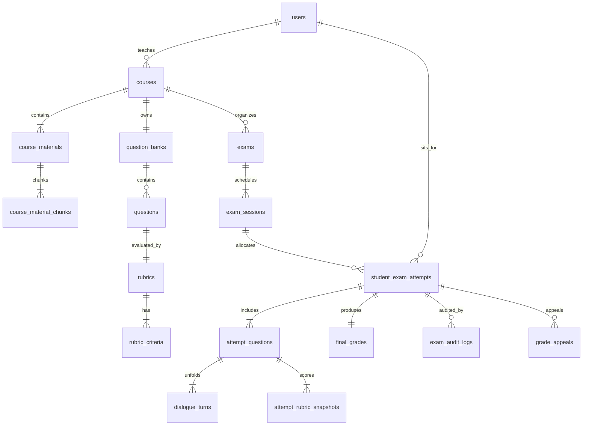

# AIVES (AI-powered Viva Exam System)
## Thiết Kế Cơ Sở Dữ Liệu Logic & Vật Lý (Database Design & Schemas)
**Mã tài liệu:** `AIVES-DOC-06-DB`

---

## 1. Triết Lý Thiết Kế & Chiến Lược Bảo Tồn Lịch Sử (Snapshot Strategy)

Cơ sở dữ liệu của AIVES được thiết kế cho hệ quản trị **PostgreSQL 16** tích hợp tiện ích mở rộng **`pgvector`**.

### Chiến lược Snapshot bảo toàn lịch sử kỳ thi:
Trong môi trường giáo dục, khi một bài thi đã hoàn thành, toàn bộ bằng chứng và barem chấm điểm phải được **đóng băng vĩnh viễn**:
- Hệ thống chia thành 2 phân vùng dữ liệu rõ rệt:
  1. **Dữ liệu Danh mục có thể thay đổi (Catalog Tables):** `questions`, `rubric_criteria`. Giảng viên có thể sửa đổi nội dung câu hỏi hoặc tỷ trọng điểm theo thời gian.
  2. **Dữ liệu Lịch sử Phiên thi Bất biến (Exam Execution Snapshot Tables):** `attempt_questions`, `attempt_rubric_snapshots`, `dialogue_turns`. Khi sinh viên bắt đầu thi, toàn bộ câu hỏi và rubric được sao chép nguyên trạng thành bản ghi snapshot. Việc giảng viên cập nhật câu hỏi trong ngân hàng sau này hoàn toàn không làm thay đổi các bản ghi snapshot này.

---

## 2. Sơ Đồ Quan Hệ Thực Thể (Entity-Relationship Diagram - ERD)



---

## 3. Đặc Tả Chi Tiết Các Bảng Dữ Liệu (Physical Table Specifications)

### 3.1. Phân hệ Quản trị & Môn học

#### Bảng `users`
Lưu trữ định danh người dùng trong toàn hệ thống.
```sql
CREATE TABLE users (
    id UUID PRIMARY KEY DEFAULT gen_random_uuid(),
    username VARCHAR(64) UNIQUE NOT NULL, -- Mã SV hoặc Mã GV
    email VARCHAR(255) UNIQUE NOT NULL,
    password_hash VARCHAR(255) NOT NULL,
    full_name VARCHAR(128) NOT NULL,
    role VARCHAR(32) NOT NULL CHECK (role IN ('ADMIN', 'LECTURER', 'STUDENT')),
    is_active BOOLEAN NOT NULL DEFAULT TRUE,
    created_at TIMESTAMP WITH TIME ZONE DEFAULT CURRENT_TIMESTAMP,
    updated_at TIMESTAMP WITH TIME ZONE DEFAULT CURRENT_TIMESTAMP
);
CREATE INDEX idx_users_role ON users(role);
CREATE INDEX idx_users_username ON users(username);
```

#### Bảng `courses` & `course_lecturers`
Quản lý môn học và phân công giảng viên phụ trách.
```sql
CREATE TABLE courses (
    id UUID PRIMARY KEY DEFAULT gen_random_uuid(),
    code VARCHAR(32) UNIQUE NOT NULL, -- VD: SE305
    name VARCHAR(255) NOT NULL,
    academic_year VARCHAR(32) NOT NULL, -- VD: 2025-2026
    semester VARCHAR(16) NOT NULL, -- VD: HK1
    created_at TIMESTAMP WITH TIME ZONE DEFAULT CURRENT_TIMESTAMP
);

CREATE TABLE course_lecturers (
    course_id UUID NOT NULL REFERENCES courses(id) ON DELETE CASCADE,
    lecturer_id UUID NOT NULL REFERENCES users(id) ON DELETE CASCADE,
    assigned_at TIMESTAMP WITH TIME ZONE DEFAULT CURRENT_TIMESTAMP,
    PRIMARY KEY (course_id, lecturer_id)
);
```

#### Bảng `course_materials` & `course_material_chunks` (Hỗ trợ RAG)
Lưu tài liệu bài giảng và vector embeddings.
```sql
CREATE TABLE course_materials (
    id UUID PRIMARY KEY DEFAULT gen_random_uuid(),
    course_id UUID NOT NULL REFERENCES courses(id) ON DELETE CASCADE,
    title VARCHAR(255) NOT NULL,
    file_url TEXT NOT NULL,
    mime_type VARCHAR(64) NOT NULL,
    indexing_status VARCHAR(32) NOT NULL DEFAULT 'PENDING' CHECK (indexing_status IN ('PENDING', 'PROCESSING', 'INDEXED', 'FAILED')),
    uploaded_by UUID NOT NULL REFERENCES users(id),
    created_at TIMESTAMP WITH TIME ZONE DEFAULT CURRENT_TIMESTAMP
);

-- Bảng Vector Chunks sử dụng pgvector
CREATE TABLE course_material_chunks (
    id UUID PRIMARY KEY DEFAULT gen_random_uuid(),
    material_id UUID NOT NULL REFERENCES course_materials(id) ON DELETE CASCADE,
    chunk_index INT NOT NULL,
    chunk_text TEXT NOT NULL,
    embedding vector(1536), -- Kích thước vector chuẩn OpenAI / text-embedding-3
    created_at TIMESTAMP WITH TIME ZONE DEFAULT CURRENT_TIMESTAMP
);
CREATE INDEX idx_material_chunks_vector ON course_material_chunks USING ivfflat (embedding vector_cosine_ops) WITH (lists = 100);
```

---

### 3.2. Phân hệ Ngân hàng Câu hỏi & Rubric

#### Bảng `question_banks` & `questions`
```sql
CREATE TABLE question_banks (
    id UUID PRIMARY KEY DEFAULT gen_random_uuid(),
    course_id UUID UNIQUE NOT NULL REFERENCES courses(id) ON DELETE CASCADE,
    name VARCHAR(255) NOT NULL,
    description TEXT,
    created_at TIMESTAMP WITH TIME ZONE DEFAULT CURRENT_TIMESTAMP
);

CREATE TABLE questions (
    id UUID PRIMARY KEY DEFAULT gen_random_uuid(),
    bank_id UUID NOT NULL REFERENCES question_banks(id) ON DELETE CASCADE,
    question_text TEXT NOT NULL,
    sample_answer TEXT NOT NULL,
    bloom_level VARCHAR(32) NOT NULL CHECK (bloom_level IN ('REMEMBER', 'UNDERSTAND', 'APPLY', 'ANALYZE')),
    origin VARCHAR(32) NOT NULL DEFAULT 'MANUAL' CHECK (origin IN ('MANUAL', 'IMPORTED', 'AI_RAG')),
    status VARCHAR(32) NOT NULL DEFAULT 'APPROVED' CHECK (status IN ('PENDING_REVIEW', 'APPROVED', 'REJECTED', 'ARCHIVED')),
    expected_duration_seconds INT NOT NULL DEFAULT 180,
    max_followup_count INT NOT NULL DEFAULT 1 CHECK (max_followup_count BETWEEN 0 AND 3),
    created_by UUID REFERENCES users(id),
    created_at TIMESTAMP WITH TIME ZONE DEFAULT CURRENT_TIMESTAMP,
    updated_at TIMESTAMP WITH TIME ZONE DEFAULT CURRENT_TIMESTAMP
);
CREATE INDEX idx_questions_bank_status ON questions(bank_id, status);
CREATE INDEX idx_questions_bloom ON questions(bloom_level);
```

#### Bảng `rubrics` & `rubric_criteria`
```sql
CREATE TABLE rubrics (
    id UUID PRIMARY KEY DEFAULT gen_random_uuid(),
    question_id UUID UNIQUE NOT NULL REFERENCES questions(id) ON DELETE CASCADE,
    name VARCHAR(255) NOT NULL,
    created_at TIMESTAMP WITH TIME ZONE DEFAULT CURRENT_TIMESTAMP
);

CREATE TABLE rubric_criteria (
    id UUID PRIMARY KEY DEFAULT gen_random_uuid(),
    rubric_id UUID NOT NULL REFERENCES rubrics(id) ON DELETE CASCADE,
    criterion_name VARCHAR(255) NOT NULL,
    description TEXT,
    weight_percent NUMERIC(5, 2) NOT NULL CHECK (weight_percent > 0 AND weight_percent <= 100),
    max_points NUMERIC(4, 2) NOT NULL CHECK (max_points > 0),
    created_at TIMESTAMP WITH TIME ZONE DEFAULT CURRENT_TIMESTAMP
);
```

---

### 3.3. Phân hệ Kỳ thi, Ca thi & Đề thi Snapshot

#### Bảng `exams` & `exam_sessions`
```sql
CREATE TABLE exams (
    id UUID PRIMARY KEY DEFAULT gen_random_uuid(),
    course_id UUID NOT NULL REFERENCES courses(id) ON DELETE CASCADE,
    title VARCHAR(255) NOT NULL,
    description TEXT,
    created_by UUID NOT NULL REFERENCES users(id),
    created_at TIMESTAMP WITH TIME ZONE DEFAULT CURRENT_TIMESTAMP
);

CREATE TABLE exam_sessions (
    id UUID PRIMARY KEY DEFAULT gen_random_uuid(),
    exam_id UUID NOT NULL REFERENCES exams(id) ON DELETE CASCADE,
    session_code VARCHAR(64) UNIQUE NOT NULL,
    start_time TIMESTAMP WITH TIME ZONE NOT NULL,
    end_time TIMESTAMP WITH TIME ZONE NOT NULL,
    duration_per_student_minutes INT NOT NULL DEFAULT 15,
    main_question_count INT NOT NULL DEFAULT 2,
    max_followup_per_question INT NOT NULL DEFAULT 1,
    status VARCHAR(32) NOT NULL DEFAULT 'SCHEDULED' CHECK (status IN ('SCHEDULED', 'RUNNING', 'COMPLETED', 'CLOSED')),
    created_at TIMESTAMP WITH TIME ZONE DEFAULT CURRENT_TIMESTAMP
);
```

#### Bảng `student_exam_attempts` (Thực thể trung tâm bài thi)
```sql
CREATE TABLE student_exam_attempts (
    id UUID PRIMARY KEY DEFAULT gen_random_uuid(),
    exam_session_id UUID NOT NULL REFERENCES exam_sessions(id) ON DELETE RESTRICT,
    student_id UUID NOT NULL REFERENCES users(id) ON DELETE RESTRICT,
    attempt_token VARCHAR(128) UNIQUE NOT NULL,
    status VARCHAR(32) NOT NULL DEFAULT 'SCHEDULED' 
        CHECK (status IN ('SCHEDULED', 'IN_PROGRESS', 'SUBMITTED', 'AI_SUGGESTED', 'IN_REVIEW', 'FINALIZED', 'PUBLISHED', 'APPEALED')),
    started_at TIMESTAMP WITH TIME ZONE,
    submitted_at TIMESTAMP WITH TIME ZONE,
    published_at TIMESTAMP WITH TIME ZONE,
    total_score NUMERIC(4, 2) CHECK (total_score >= 0 AND total_score <= 10),
    letter_grade VARCHAR(4),
    created_at TIMESTAMP WITH TIME ZONE DEFAULT CURRENT_TIMESTAMP,
    CONSTRAINT uq_student_session UNIQUE (exam_session_id, student_id)
);
CREATE INDEX idx_attempts_session_status ON student_exam_attempts(exam_session_id, status);
CREATE INDEX idx_attempts_student ON student_exam_attempts(student_id);
```

#### Bảng `attempt_questions` (Snapshot câu hỏi của bài thi)
```sql
CREATE TABLE attempt_questions (
    id UUID PRIMARY KEY DEFAULT gen_random_uuid(),
    attempt_id UUID NOT NULL REFERENCES student_exam_attempts(id) ON DELETE CASCADE,
    original_question_id UUID REFERENCES questions(id) ON DELETE SET NULL,
    question_order INT NOT NULL, -- Câu hỏi số 1, số 2...
    snapshot_question_text TEXT NOT NULL, -- Bản sao bất biến câu hỏi
    snapshot_sample_answer TEXT NOT NULL,
    snapshot_bloom_level VARCHAR(32) NOT NULL,
    max_score NUMERIC(4, 2) NOT NULL,
    ai_suggested_score NUMERIC(4, 2),
    final_score NUMERIC(4, 2),
    created_at TIMESTAMP WITH TIME ZONE DEFAULT CURRENT_TIMESTAMP
);
```

#### Bảng `attempt_rubric_snapshots` (Snapshot Rubric & Điểm thành phần)
```sql
CREATE TABLE attempt_rubric_snapshots (
    id UUID PRIMARY KEY DEFAULT gen_random_uuid(),
    attempt_question_id UUID NOT NULL REFERENCES attempt_questions(id) ON DELETE CASCADE,
    criterion_name VARCHAR(255) NOT NULL,
    weight_percent NUMERIC(5, 2) NOT NULL,
    max_points NUMERIC(4, 2) NOT NULL,
    ai_suggested_points NUMERIC(4, 2),
    ai_reasoning TEXT,
    lecturer_final_points NUMERIC(4, 2),
    lecturer_comment TEXT,
    created_at TIMESTAMP WITH TIME ZONE DEFAULT CURRENT_TIMESTAMP
);
```

#### Bảng `dialogue_turns` (Lượt đối thoại âm thanh & bóc băng)
```sql
CREATE TABLE dialogue_turns (
    id UUID PRIMARY KEY DEFAULT gen_random_uuid(),
    attempt_question_id UUID NOT NULL REFERENCES attempt_questions(id) ON DELETE CASCADE,
    turn_index INT NOT NULL, -- 0: Câu chính; 1, 2: Hỏi xoáy
    turn_type VARCHAR(32) NOT NULL CHECK (turn_type IN ('MAIN_QUESTION', 'ADAPTIVE_FOLLOW_UP')),
    ai_prompt_text TEXT NOT NULL,
    student_transcript TEXT,
    audio_recording_url TEXT,
    pause_duration_seconds NUMERIC(4, 2),
    speaking_rate_wpm INT,
    turn_started_at TIMESTAMP WITH TIME ZONE,
    turn_ended_at TIMESTAMP WITH TIME ZONE
);
CREATE INDEX idx_turns_question ON dialogue_turns(attempt_question_id, turn_index);
```

---

### 3.4. Phân hệ Báo cáo, Đánh giá & Audit

#### Bảng `final_grades`
Lưu kết quả điểm số chính thức và nhận xét tổng kết.
```sql
CREATE TABLE final_grades (
    id UUID PRIMARY KEY DEFAULT gen_random_uuid(),
    attempt_id UUID UNIQUE NOT NULL REFERENCES student_exam_attempts(id) ON DELETE CASCADE,
    lecturer_id UUID NOT NULL REFERENCES users(id),
    total_score NUMERIC(4, 2) NOT NULL CHECK (total_score >= 0 AND total_score <= 10),
    letter_grade VARCHAR(4) NOT NULL,
    gpa_4_scale NUMERIC(3, 2) NOT NULL,
    summary_feedback JSONB NOT NULL, -- {key_strengths: [], areas_for_improvement: [], recommended_review_topics: []}
    publish_status VARCHAR(32) NOT NULL DEFAULT 'DRAFT' CHECK (publish_status IN ('DRAFT', 'PUBLISHED')),
    finalized_at TIMESTAMP WITH TIME ZONE DEFAULT CURRENT_TIMESTAMP,
    created_at TIMESTAMP WITH TIME ZONE DEFAULT CURRENT_TIMESTAMP
);
```

#### Bảng `exam_audit_logs` (Nhật ký kiểm toán bất biến - Append-Only)
```sql
CREATE TABLE exam_audit_logs (
    id UUID PRIMARY KEY DEFAULT gen_random_uuid(),
    attempt_id UUID NOT NULL REFERENCES student_exam_attempts(id) ON DELETE CASCADE,
    action_type VARCHAR(64) NOT NULL, -- GRADE_OVERRIDE, PUBLISH_GRADE, APPEAL_LOG
    performed_by UUID NOT NULL REFERENCES users(id),
    old_value JSONB,
    new_value JSONB,
    justification TEXT,
    logged_at TIMESTAMP WITH TIME ZONE DEFAULT CURRENT_TIMESTAMP
);
CREATE INDEX idx_audit_attempt ON exam_audit_logs(attempt_id);
```

#### Bảng `grade_appeals` (Đơn khiếu nại điểm)
```sql
CREATE TABLE grade_appeals (
    id UUID PRIMARY KEY DEFAULT gen_random_uuid(),
    attempt_id UUID NOT NULL REFERENCES student_exam_attempts(id) ON DELETE CASCADE,
    attempt_question_id UUID REFERENCES attempt_questions(id),
    student_id UUID NOT NULL REFERENCES users(id),
    reason TEXT NOT NULL,
    status VARCHAR(32) NOT NULL DEFAULT 'PENDING' CHECK (status IN ('PENDING', 'ACCEPTED', 'REJECTED')),
    resolution_note TEXT,
    resolved_by UUID REFERENCES users(id),
    created_at TIMESTAMP WITH TIME ZONE DEFAULT CURRENT_TIMESTAMP,
    resolved_at TIMESTAMP WITH TIME ZONE
);
```

---

## 4. Chiến Lược Đánh Chỉ Mục & Tối Ưu Hóa Truy Vấn (Indexing Strategy)

1. **Tối ưu tra cứu phiên thi & bảo mật:**
   - Index trên `(exam_session_id, student_id)` đảm bảo mỗi sinh viên chỉ có duy nhất 1 phiên thi trong ca thi và tra cứu nhanh tức thì ($O(1)$).
2. **Tối ưu màn hình Dashboard Giảng viên:**
   - Composite index `(exam_session_id, status)` trên `student_exam_attempts` giúp giảng viên lọc nhanh các bài thi "Chờ chấm" (`AI_SUGGESTED`) hoặc tính toán phổ điểm thống kê lớp học với tốc độ mili-giây.
3. **Tối ưu tìm kiếm Vector RAG:**
   - Sử dụng index `ivfflat` hoặc `hnsw` trên cột `course_material_chunks.embedding` với khoảng cách cosine (`vector_cosine_ops`), cho phép tìm kiếm Top-K tài liệu liên quan trong vòng $< 30\text{ms}$.
