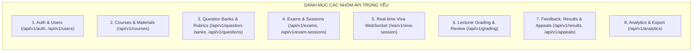

# AIVES (AI-powered Viva Exam System)
## Đặc Tả Giao Diện Lập Trình Ứng Dụng (REST & WebSocket API Specifications)
**Mã tài liệu:** `AIVES-DOC-08-API`

---

## 1. Tiêu Chuẩn Thiết Kế API & Mã Trạng Thái HTTP

- **Chuẩn định dạng:** RESTful API qua giao thức HTTPS và WebSockets qua giao thức WSS.
- **Tiền tố phiên bản:** `/api/v1` cho toàn bộ các endpoint REST.
- **Xác thực:** Bearer JWT Token gửi qua HTTP Header `Authorization: Bearer <token>`.
- **Mã phản hồi chuẩn:**
  - `200 OK`: Truy vấn thành công hoặc cập nhật thành công.
  - `201 Created`: Tạo mới tài nguyên thành công.
  - `400 Bad Request`: Dữ liệu đầu vào sai cấu trúc hoặc vi phạm luật nghiệp vụ.
  - `401 Unauthorized`: Chưa đăng nhập hoặc token không hợp lệ/hết hạn.
  - `403 Forbidden`: Người dùng không có quyền truy cập tài nguyên (sai Role hoặc không phụ trách môn học).
  - `404 Not Found`: Không tìm thấy tài nguyên với ID tương ứng.
  - `422 Unprocessable Entity`: Dữ liệu vi phạm validation schema.
  - `500 Internal Server Error`: Lỗi hệ thống nội bộ.

---

## 2. Danh Mục Các Nhóm API Chính (API Endpoint Catalog)



---

## 3. Đặc Tả Chi Tiết Từng Nhóm API

### 3.1. Nhóm 1: Xác Thực & Người Dùng (Auth & Users)

#### API-01: Đăng nhập hệ thống
- **Method & Endpoint:** `POST /api/v1/auth/login`
- **Tác tử:** `ALL` (Student, Lecturer, Admin)
- **Mục đích:** Xác thực danh tính và trả về JWT Access Token kèm vai trò.
- **Yêu cầu (Request Body):**
  ```json
  {
    "username": "21120001",
    "password": "SecurePassword123!"
  }
  ```
- **Phản hồi (Response 200 OK):**
  ```json
  {
    "access_token": "eyJhbGciOiJIUzI1...",
    "token_type": "bearer",
    "expires_in": 86400,
    "user": {
      "id": "3fa85f64-5717-4562-b3fc-2c963f66afa6",
      "username": "21120001",
      "full_name": "Nguyễn Văn An",
      "role": "STUDENT"
    }
  }
  ```
- **Yêu cầu liên quan:** `FR-028`.

---

### 3.2. Nhóm 2: Môn Học & Tài Liệu RAG (Courses & Materials)

#### API-02: Tải lên tài liệu môn học phục vụ RAG
- **Method & Endpoint:** `POST /api/v1/courses/{course_id}/materials`
- **Tác tử:** `LECTURER`, `ADMIN`
- **Phân quyền:** Chỉ giảng viên được phân công môn học này.
- **Mục đích:** Tải lên tệp slide/giáo trình và kích hoạt tiến trình băm đoạn (chunking & vector embedding).
- **Yêu cầu (Multipart Form Data):**
  - `file`: Tệp tài liệu định dạng `.pdf`, `.docx` (tối đa 50MB).
  - `title`: Chuỗi tên tiêu đề tài liệu.
- **Phản hồi (Response 201 Created):**
  ```json
  {
    "material_id": "8e3b4a2e-4b2e-48a3-9cb1-92b1a8d4a91b",
    "course_id": "7b2e1a3c-5c1e-42a1-8cb1-81a1b2c3d4e5",
    "title": "Chương 4: Kế thừa và Đa hình trong OOP",
    "indexing_status": "PROCESSING",
    "created_at": "2026-09-22T14:20:00Z"
  }
  ```
- **Yêu cầu liên quan:** `FR-003`.

---

### 3.3. Nhóm 3: Ngân Hàng Câu Hỏi & Rubric

#### API-03: AI sinh câu hỏi RAG từ tài liệu môn học
- **Method & Endpoint:** `POST /api/v1/courses/{course_id}/questions/ai-generate`
- **Tác tử:** `LECTURER`
- **Mục đích:** Kích hoạt LLM trích xuất tài liệu và tạo câu hỏi vấn đáp nháp.
- **Yêu cầu (Request Body):**
  ```json
  {
    "material_id": "8e3b4a2e-4b2e-48a3-9cb1-92b1a8d4a91b",
    "topic": "Đa kế thừa và Virtual Table",
    "bloom_level": "ANALYZE",
    "count": 2
  }
  ```
- **Phản hồi (Response 200 OK):**
  ```json
  {
    "generated_questions": [
      {
        "id": "1c3d5e7f-9a1b-4c3d-8e5f-7a9b1c3d5e7f",
        "question_text": "Em hãy phân tích cơ chế giải quyết xung đột khi implements 2 interface có cùng default method trong Java?",
        "sample_answer": "Java bắt buộc class triển khai phải override phương thức trùng tên và chỉ định rõ dùng super của interface nào...",
        "bloom_level": "ANALYZE",
        "status": "PENDING_REVIEW",
        "suggested_rubric": [
          { "criterion_name": "Độ chính xác khái niệm", "weight_percent": 40, "max_points": 2.0 },
          { "criterion_name": "Khả năng giải thích giải pháp", "weight_percent": 40, "max_points": 2.0 },
          { "criterion_name": "Độ trôi chảy thuật ngữ", "weight_percent": 20, "max_points": 1.0 }
        ]
      }
    ]
  }
  ```
- **Yêu cầu liên quan:** `FR-003`, `FR-004`, `FR-005`.

#### API-04: Giảng viên phê duyệt câu hỏi AI
- **Method & Endpoint:** `PATCH /api/v1/questions/{question_id}/review`
- **Tác tử:** `LECTURER`
- **Mục đích:** Phê duyệt (`APPROVED`) hoặc Từ chối (`REJECTED`) câu hỏi nháp.
- **Yêu cầu (Request Body):**
  ```json
  {
    "action": "APPROVE", // APPROVE | REJECT
    "edited_question_text": "Em hãy phân tích cơ chế giải quyết xung đột khi implements 2 interface có default method trùng tên trong Java 8+?",
    "edited_bloom_level": "ANALYZE"
  }
  ```
- **Phản hồi (Response 200 OK):**
  ```json
  {
    "question_id": "1c3d5e7f-9a1b-4c3d-8e5f-7a9b1c3d5e7f",
    "status": "APPROVED",
    "updated_at": "2026-09-22T14:30:00Z"
  }
  ```
- **Yêu cầu liên quan:** `FR-006`, `BR-001`.

---

### 3.4. Nhóm 4: Kỳ Thi & Ca Thi (Exams & Sessions)

#### API-05: Tạo ca thi vấn đáp
- **Method & Endpoint:** `POST /api/v1/exams/{exam_id}/sessions`
- **Tác tử:** `LECTURER`
- **Mục đích:** Thiết lập cấu hình phòng thi và thời lượng.
- **Yêu cầu (Request Body):**
  ```json
  {
    "session_code": "VIVA-OOP-HK1-2026-CA1",
    "start_time": "2026-09-23T08:00:00Z",
    "end_time": "2026-09-23T11:30:00Z",
    "duration_per_student_minutes": 15,
    "main_question_count": 2,
    "max_followup_per_question": 2,
    "student_ids": [
      "3fa85f64-5717-4562-b3fc-2c963f66afa6",
      "9bc12d34-1234-4567-89ab-cdef01234567"
    ]
  }
  ```
- **Phản hồi (Response 201 Created):**
  ```json
  {
    "session_id": "a1b2c3d4-e5f6-7a8b-9c0d-1e2f3a4b5c6d",
    "session_code": "VIVA-OOP-HK1-2026-CA1",
    "allocated_students_count": 2,
    "status": "SCHEDULED"
  }
  ```
- **Yêu cầu liên quan:** `FR-007`, `FR-008`.

---

### 3.5. Nhóm 5: Luồng Vấn Đáp Thời Gian Gần Thực (Real-time Viva WebSocket)

#### API-06: Kênh WebSocket Tương tác Viva Hai chiều
- **Protocol & Endpoint:** `WSS /ws/v1/viva-session?attempt_token={token}`
- **Tác tử:** `STUDENT`
- **Mục đích:** Kênh truyền tải luồng âm thanh micro, nhận câu hỏi giọng nói và điều phối luồng hỏi đáp viva.
- **Các thông điệp JSON trao đổi trên kênh WebSocket:**

##### 1. Khởi động ca thi (Client -> Server)
```json
{
  "type": "START_EXAM_REQUEST"
}
```

##### 2. AI Đặt câu hỏi (Server -> Client)
```json
{
  "type": "AI_QUESTION_START",
  "question_order": 1,
  "turn_index": 0,
  "turn_type": "MAIN_QUESTION",
  "question_text": "Em hãy phân biệt sự khác nhau giữa Abstract Class và Interface?",
  "audio_payload_base64": "UklGRi4AAABXQVZFZm10IBAAAAABAAEA...",
  "time_limit_seconds": 180
}
```

##### 3. Sinh viên trả lời (Client -> Server - Gói nhị phân hoặc chuỗi Base64 Audio Chunk)
```json
{
  "type": "STUDENT_AUDIO_CHUNK",
  "chunk_index": 12,
  "audio_bytes_base64": "s8vQwsPGx8jJ..."
}
```

##### 4. Báo hiệu sinh viên kết thúc nói (Client -> Server hoặc do VAD phát hiện)
```json
{
  "type": "STUDENT_SPEECH_FINISHED"
}
```

##### 5. AI Phản hồi Hỏi xoáy hoặc Chuyển câu (Server -> Client)
```json
{
  "type": "AI_FOLLOWUP_START",
  "question_order": 1,
  "turn_index": 1,
  "turn_type": "ADAPTIVE_FOLLOW_UP",
  "question_text": "Vậy trong Java 8, tại sao lại bổ sung Default Method vào Interface?",
  "audio_payload_base64": "UklGRi4AAABXQVZFZm10IBAAAAABAAEA..."
}
```

- **Yêu cầu liên quan:** `FR-011`, `FR-012`, `FR-013`, `FR-014`, `FR-015`, `FR-016`.

---

### 3.6. Nhóm 6: Thẩm Định & Chấm Điểm (Lecturer Grading & Human-in-the-Loop)

#### API-07: Giảng viên xem chi tiết bài thi & điểm AI gợi ý
- **Method & Endpoint:** `GET /api/v1/grading/attempts/{attempt_id}`
- **Tác tử:** `LECTURER`
- **Mục đích:** Lấy toàn bộ transcript, audio url, và barem điểm AI đề xuất để giảng viên chấm.
- **Phản hồi (Response 200 OK):**
  ```json
  {
    "attempt_id": "att-001",
    "student_name": "Nguyễn Văn An",
    "status": "AI_SUGGESTED",
    "ai_total_suggested_score": 8.3,
    "questions": [
      {
        "question_id": "q-1",
        "question_text": "Em hãy phân biệt Abstract Class và Interface?",
        "ai_suggested_score": 4.5,
        "turns": [
          {
            "turn_index": 0,
            "turn_type": "MAIN_QUESTION",
            "prompt": "Em hãy phân biệt Abstract Class và Interface?",
            "transcript": "Dạ thưa thầy, Abstract Class có thể chứa code thực thi...",
            "audio_presigned_url": "https://storage.aives.edu.vn/audio/att-001-q1-t0.mp3?token=exp15m"
          }
        ],
        "rubric_evaluations": [
          {
            "criterion_name": "Độ chính xác khái niệm",
            "max_points": 2.0,
            "ai_suggested_points": 2.0,
            "ai_reasoning": "Sinh viên nêu rõ bản chất IS-A và CAN-DO."
          }
        ]
      }
    ]
  }
  ```
- **Yêu cầu liên quan:** `FR-017`, `FR-018`, `FR-019`.

#### API-08: Giảng viên chốt và công bố điểm
- **Method & Endpoint:** `POST /api/v1/grading/attempts/{attempt_id}/finalize`
- **Tác tử:** `LECTURER`
- **Mục đích:** Lưu điểm số chính thức và công bố cho sinh viên.
- **Yêu cầu (Request Body):**
  ```json
  {
    "final_total_score": 8.5,
    "rubric_adjustments": [
      {
        "attempt_rubric_id": "rub-01",
        "lecturer_final_points": 2.0,
        "comment": "Lập luận sắc bén"
      }
    ],
    "lecturer_summary_feedback": "Nắm vững bản chất OOP.",
    "publish_now": true
  }
  ```
- **Phản hồi (Response 200 OK):**
  ```json
  {
    "attempt_id": "att-001",
    "status": "PUBLISHED",
    "total_score": 8.5,
    "letter_grade": "A",
    "published_at": "2026-09-22T16:00:00Z"
  }
  ```
- **Yêu cầu liên quan:** `FR-020`, `BR-002`, `BR-003`, `BR-006`.

---

### 3.7. Nhóm 7: Báo Cáo Sinh Viên & Khiếu Nại (Results & Appeals)

#### API-09: Sinh viên xem báo cáo kết quả thi
- **Method & Endpoint:** `GET /api/v1/results/my-report?session_id={session_id}`
- **Tác tử:** `STUDENT`
- **Phân quyền:** Chỉ trả về kết quả khi trạng thái bài thi là `PUBLISHED`.
- **Phản hồi (Response 200 OK):** Trả về toàn bộ chi tiết điểm từng câu, nhận xét AI/giảng viên, và transcript.
- **Yêu cầu liên quan:** `FR-024`.

#### API-10: Sinh viên gửi đơn khiếu nại điểm
- **Method & Endpoint:** `POST /api/v1/appeals`
- **Tác tử:** `STUDENT`
- **Yêu cầu (Request Body):**
  ```json
  {
    "attempt_id": "att-001",
    "attempt_question_id": "q-1",
    "reason": "Em đã nêu rõ default method trong Interface ở phút thứ 3:20 nhưng bị trừ điểm tiêu chí phản biện."
  }
  ```
- **Phản hồi (Response 201 Created):**
  ```json
  {
    "appeal_id": "app-001",
    "status": "PENDING",
    "message": "Đơn khiếu nại đã được gửi tới Giảng viên phụ trách môn học."
  }
  ```
- **Yêu cầu liên quan:** `FR-023`.

---

### 3.8. Nhóm 8: Thống Kê Lớp Học & Xuất Bảng Điểm (Analytics & Export)

#### API-11: Lấy dữ liệu thống kê phân tích lớp học
- **Method & Endpoint:** `GET /api/v1/analytics/sessions/{session_id}`
- **Tác tử:** `LECTURER`, `ADMIN`
- **Phản hồi (Response 200 OK):**
  ```json
  {
    "session_id": "session-101",
    "total_students": 45,
    "graded_students": 45,
    "score_metrics": {
      "mean": 7.42,
      "median": 7.5,
      "min": 4.0,
      "max": 9.5,
      "pass_rate_percent": 95.5
    },
    "score_distribution": {
      "A": 8, "B": 20, "C": 12, "D": 3, "F": 2
    },
    "difficult_questions": [
      {
        "question_text": "Phân tích cơ chế Virtual Table trong C++",
        "average_score_ratio": 0.48,
        "bloom_level": "ANALYZE"
      }
    ],
    "ai_concordance_rate_percent": 88.5
  }
  ```
- **Yêu cầu liên quan:** `FR-025`, `FR-026`.

#### API-12: Xuất bảng điểm lớp học ra file Excel
- **Method & Endpoint:** `GET /api/v1/analytics/sessions/{session_id}/export-excel`
- **Tác tử:** `LECTURER`, `ADMIN`
- **Phản hồi (Response 200 OK):**
  - Trả về dòng nhị phân file Excel (.xlsx), MIME type: `application/vnd.openxmlformats-officedocument.spreadsheetml.sheet`.
  - Header: `Content-Disposition: attachment; filename="BangDiem_VIVA_OOP_2026.xlsx"`.
- **Yêu cầu liên quan:** `FR-027`.
