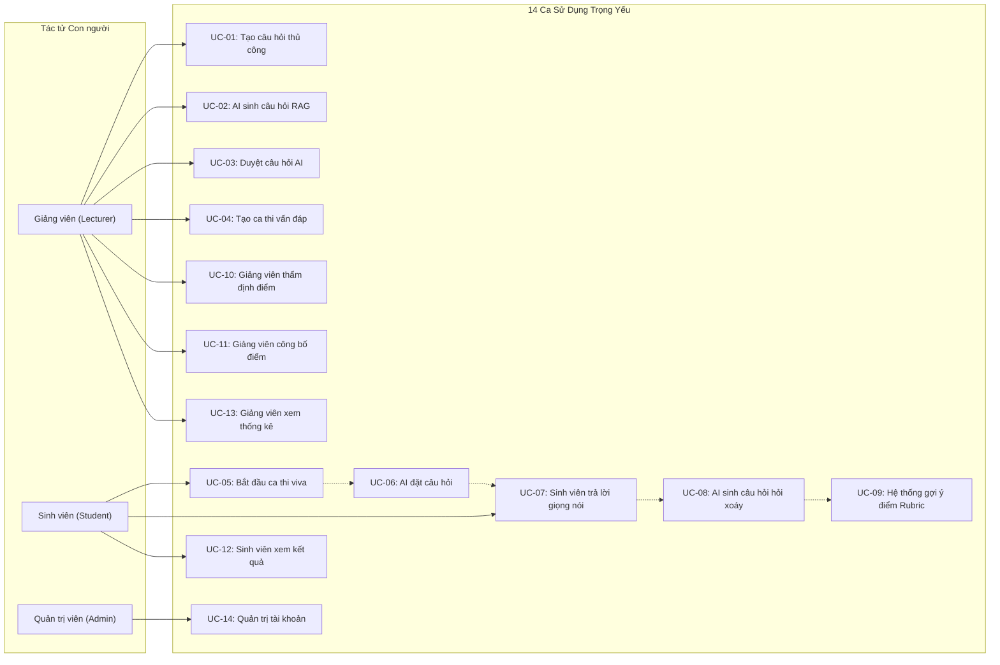

# AIVES (AI-powered Viva Exam System)
## Tài Liệu Đặc Tả Tác Tử & 14 Ca Sử Dụng (Actors & Use Cases)
**Mã tài liệu:** `AIVES-DOC-02-UC`

---

## 1. Phân Tích Danh Mục Tác Tử (Actors Analysis)

### 1.1. Tác tử con người (Human Actors)

| Tác tử (Actor) | Trách nhiệm chính trong hệ thống | Quyền hạn truy cập |
|---|---|---|
| **Giảng viên (Lecturer)** | - Tạo, duyệt và quản lý ngân hàng câu hỏi, tiêu chí Rubric. - Thiết lập ca thi, gán danh sách sinh viên. - Giám sát buổi thi, xem lại transcript và audio ghi âm. - Thẩm định điểm số AI gợi ý, điều chỉnh và chốt điểm chính thức (`FinalGrade`). - Xử lý các khiếu nại điểm của sinh viên và phân tích báo cáo lớp học. | Quyền thao tác trên các môn học và ca thi được phân công phụ trách. |
| **Sinh viên (Student)** | - Đăng nhập phòng thi vấn đáp ảo đúng ca thi quy định. - Lắng nghe câu hỏi giọng nói từ AI và trả lời bằng giọng nói qua micro. - Tương tác với câu hỏi hỏi xoáy của AI. - Xem báo cáo phản hồi chi tiết sau khi điểm được công bố. - Nộp đơn khiếu nại điểm kèm bằng chứng nếu có thắc mắc. | Quyền thi trong ca thi được phân bổ; chỉ xem được dữ liệu và bài thi của chính mình. |
| **Quản trị viên (Administrator)** | - Quản trị người dùng, phân quyền vai trò (`LECTURER`, `STUDENT`, `ADMIN`). - Phân công giảng viên phụ trách môn học. - Quản lý cấu hình tích hợp hệ thống (STT/TTS API keys, ngưỡng tham số VAD, quota tài nguyên). | Quyền quản trị toàn hệ thống. |

### 1.2. Tác tử hệ thống & Dịch vụ bên ngoài (System & External Actors)

| Tác tử dịch vụ (System/Service Actor) | Trách nhiệm chuyên biệt | Giao thức tích hợp |
|---|---|---|
| **Dịch vụ Quản trị AI (AI Orchestration Service)** | Điều phối toàn bộ luồng RAG, phân tích ngữ nghĩa, quyết định hỏi xoáy thích ứng và so khớp Rubric gợi ý điểm. | Internal Service / gRPC / REST |
| **Dịch vụ Chuyển giọng nói thành văn bản (STT Provider)** | Nhận luồng âm thanh micro từ sinh viên và bóc băng thành văn bản tiếng Việt/Anh thời gian thực. | WebSockets / Streaming gRPC / REST |
| **Dịch vụ Chuyển văn bản thành giọng nói (TTS Provider)** | Nhận văn bản câu hỏi từ AI và chuyển thành giọng đọc tiếng Việt tự nhiên phát cho sinh viên. | Streaming REST / Audio Chunking |
| **Dịch vụ Mô hình Ngôn ngữ Lớn (LLM Provider)** | Xử lý RAG sinh câu hỏi, sinh câu hỏi hỏi xoáy thích ứng, đối chiếu rubric và sinh nhận xét điểm mạnh/yếu. | OpenAI / Anthropic / Google Gemini API / Local vLLM |
| **Dịch vụ Lưu trữ Tệp & Đa phương tiện (Object Storage Service)** | Lưu trữ tài liệu môn học (PDF/DOCX), file ghi âm âm thanh (.mp3/webm) của các phiên thi. | S3-Compatible API / MinIO / Local FS |
| **Dịch vụ Xác thực & Định danh (Identity / Auth Service)** | Xác thực thông tin đăng nhập, cấp phát JWT token, phân quyền RBAC (sẵn sàng tích hợp SSO trường học). | OAuth2 / OIDC / JWT |

---

## 2. Sơ Đồ Tổng Quan 14 Ca Sử Dụng (Use Case Diagram)

---

## 3. Đặc Tả Chi Tiết 14 Ca Sử Dụng Trọng Yếu (Detailed Use Cases)

---

### UC-01: Giảng viên tạo câu hỏi thủ công (Lecturer Creates Question Manually)
- **Tác tử chính:** Giảng viên (`Lecturer`).
- **Kích hoạt (Trigger):** Giảng viên bấm nút "Tạo câu hỏi mới" trên giao diện Ngân hàng câu hỏi.
- **Tiền điều kiện (Preconditions):** Giảng viên đã đăng nhập và được phân quyền phụ trách môn học tương ứng.
- **Luồng sự kiện chính (Main Flow):**
  1. Giảng viên chọn Môn học và Chủ đề (Topic).
  2. Giảng viên nhập nội dung câu hỏi chính và câu trả lời mẫu/ý chính cần đạt.
  3. Giảng viên gán mức độ nhận thức theo Thang Bloom (*Remember, Understand, Apply, Analyze*).
  4. Giảng viên thiết lập thời lượng trả lời dự kiến (giây) và số lượt hỏi xoáy tối đa ($N_{max} \in [0, 3]$).
  5. Giảng viên định nghĩa hoặc chọn bảng Rubric liên kết (các tiêu chí thành phần và tỷ trọng %).
  6. Giảng viên bấm "Lưu vào ngân hàng".
  7. Hệ thống kiểm tra hợp lệ, lưu câu hỏi ở trạng thái `APPROVED` và hiển thị thông báo thành công.
- **Luồng thay thế (Alternative Flow):**
  - *3a. AI gợi ý nhãn Bloom:* Giảng viên bấm "AI gợi ý mức độ Bloom", hệ thống phân tích văn bản và đề xuất nhãn phù hợp để giảng viên xác nhận.
- **Luồng ngoại lệ (Exception Flow):**
  - *5a. Tổng trọng số Rubric không bằng 100%:* Hệ thống cảnh báo lỗi, không cho lưu và yêu cầu điều chỉnh lại tỷ trọng điểm.
- **Hậu điều kiện (Postconditions):** Câu hỏi mới được lưu vào CSDL với trạng thái chính thức, sẵn sàng được bốc vào đề thi.
- **Yêu cầu liên quan:** `FR-001`, `FR-004`, `FR-005`.

---

### UC-02: AI sinh câu hỏi từ tài liệu môn học (AI Generates Questions via RAG)
- **Tác tử chính:** Giảng viên (`Lecturer`), Dịch vụ Quản trị AI (`AI Orchestration Service`), `LLM Provider`.
- **Kích hoạt:** Giảng viên chọn chức năng "AI sinh câu hỏi từ tài liệu" trong kho môn học.
- **Tiền điều kiện:** Môn học đã có tài liệu giáo trình/slide được tải lên và lập chỉ mục Vector thành công.
- **Luồng sự kiện chính:**
  1. Giảng viên chọn tài liệu nguồn, nhập chủ đề cần sinh câu hỏi và chọn mức độ Bloom mong muốn.
  2. Hệ thống gửi truy vấn đến Vector Database để trích xuất các đoạn tài liệu liên quan nhất (RAG Context).
  3. Hệ thống cấu trúc prompt và gọi LLM để sinh ra danh sách câu hỏi nháp, kèm theo:
     - Nội dung câu hỏi vấn đáp.
     - Căn cứ trích dẫn nguồn từ tài liệu (trang, đoạn).
     - Barem tiêu chí Rubric gợi ý.
  4. Hệ thống lưu các câu hỏi vào CSDL với trạng thái `PENDING_REVIEW`.
  5. Giao diện hiển thị danh sách câu hỏi AI vừa sinh để giảng viên kiểm tra.
- **Luồng thay thế:**
  - *1a. Giảng viên tải tài liệu mới lên:* Giảng viên tải file PDF/DOCX mới; hệ thống xử lý trích xuất văn bản và tạo embedding trước khi sinh câu hỏi.
- **Luồng ngoại lệ:**
  - *2a. Không tìm thấy ngữ cảnh phù hợp trong tài liệu:* Hệ thống thông báo tài liệu chưa đủ thông tin về chủ đề này và yêu cầu giảng viên điều chỉnh từ khóa tìm kiếm.
  - *3a. Lỗi kết nối LLM Provider:* Hệ thống báo lỗi kết nối, không lưu dữ liệu rác và cho phép thử lại.
- **Hậu điều kiện:** Các câu hỏi nháp được tạo ở trạng thái `PENDING_REVIEW` (chưa được đưa vào đề thi).
- **Yêu cầu liên quan:** `FR-003`, `FR-004`, `FR-005`, `BR-001`.

---

### UC-03: Giảng viên thẩm định câu hỏi AI (Lecturer Reviews AI-Generated Questions)
- **Tác tử chính:** Giảng viên (`Lecturer`).
- **Kích hoạt:** Giảng viên mở danh mục "Câu hỏi chờ duyệt" (`PENDING_REVIEW`).
- **Tiền điều kiện:** Đã có câu hỏi do AI sinh ra ở trạng thái `PENDING_REVIEW`.
- **Luồng sự kiện chính:**
  1. Giảng viên xem chi tiết từng câu hỏi: nội dung, đoạn trích nguồn tham chiếu, barem Rubric đề xuất.
  2. Giảng viên có thể chỉnh sửa trực tiếp câu từ, điều chỉnh mức độ Bloom hoặc sửa tiêu chí Rubric.
  3. Giảng viên bấm nút "Phê duyệt" (`APPROVED`).
  4. Hệ thống cập nhật trạng thái câu hỏi thành `APPROVED` và chuyển vào ngân hàng chính thức.
- **Luồng thay thế:**
  - *3a. Từ chối câu hỏi:* Giảng viên thấy câu hỏi không đạt chất lượng, bấm nút "Loại bỏ" (`REJECTED`). Hệ thống cập nhật trạng thái hoặc xóa khỏi danh mục chờ.
- **Luồng ngoại lệ:**
  - *2a. Giảng viên sửa xóa toàn bộ tiêu chí Rubric:* Hệ thống ngăn chặn việc lưu câu hỏi không có Rubric chấm điểm.
- **Hậu điều kiện:** Câu hỏi chuyển sang trạng thái `APPROVED` hoặc `REJECTED`. Chỉ câu hỏi `APPROVED` mới có thể xuất hiện trong đề thi.
- **Yêu cầu liên quan:** `FR-006`, `BR-001`.

---

### UC-04: Giảng viên tạo và cấu hình ca thi (Lecturer Creates Exam Session)
- **Tác tử chính:** Giảng viên (`Lecturer`).
- **Kích hoạt:** Giảng viên chọn "Tạo kỳ thi vấn đáp mới".
- **Tiền điều kiện:** Môn học đã có đủ số lượng câu hỏi `APPROVED` trong ngân hàng theo các mức độ Bloom.
- **Luồng sự kiện chính:**
  1. Giảng viên nhập Tên kỳ thi, chọn Môn học.
  2. Giảng viên cấu hình quy chế ca thi:
     - Thời gian bắt đầu và kết thúc ca thi.
     - Thời lượng tối đa cho mỗi thí sinh (ví dụ: 15 phút/em).
     - Số lượng câu hỏi chính mỗi thí sinh phải trả lời (ví dụ: 2 câu: 1 câu Hiểu, 1 câu Vận dụng).
     - Giới hạn số lượt hỏi xoáy tối đa mỗi câu.
  3. Giảng viên tải lên danh sách sinh viên dự thi (file Excel/CSV).
  4. Hệ thống xác thực danh sách sinh viên, tạo các bản ghi `StudentExamAttempt` với mã định danh phiên thi duy nhất.
  5. Giảng viên bấm "Lưu và Kích hoạt ca thi".
  6. Hệ thống gửi thông báo/mã phòng thi tới danh sách sinh viên.
- **Luồng thay thế:**
  - *3a. Chọn sinh viên từ lớp học có sẵn:* Giảng viên tick chọn cả lớp đã được đồng bộ trên hệ thống thay vì upload Excel.
- **Luồng ngoại lệ:**
  - *1a. Ngân hàng câu hỏi không đủ số lượng câu yêu cầu theo cấu hình Bloom:* Hệ thống cảnh báo thiếu câu hỏi (ví dụ: "Ngân hàng chỉ có 1 câu mức Vận dụng, ca thi yêu cầu tối thiểu 5 câu để bốc ngẫu nhiên") và yêu cầu bổ sung câu hỏi trước khi tạo ca thi.
- **Hậu điều kiện:** Kỳ thi và danh sách các phiên thi cá nhân được khởi tạo ở trạng thái `SCHEDULED`.
- **Yêu cầu liên quan:** `FR-007`, `FR-008`, `FR-009`.

---

### UC-05: Sinh viên bắt đầu phiên thi Viva (Student Starts Viva Exam)
- **Tác tử chính:** Sinh viên (`Student`), Hệ thống.
- **Kích hoạt:** Sinh viên truy cập vào phòng thi ảo theo mã ca thi đã được cấp.
- **Tiền điều kiện:** Ca thi đang trong khung giờ mở; tài khoản sinh viên nằm trong danh sách thi; thiết bị có micro và loa hoạt động.
- **Luồng sự kiện chính:**
  1. Sinh viên đăng nhập vào hệ thống, chọn ca thi viva.
  2. Hệ thống yêu cầu kiểm tra thiết bị: Test loa (nghe thử một đoạn audio) và Test Micro (nói thử và hiển thị sóng âm).
  3. Sinh viên xác nhận sẵn sàng và bấm "Bắt đầu thi".
  4. Hệ thống kích hoạt thuật toán bốc đề ngẫu nhiên theo cấu hình Bloom của ca thi, lưu bản ghi Snapshot đề thi bất biến vào `StudentExamAttempt`.
  5. Trạng thái phiên thi chuyển thành `IN_PROGRESS`.
  6. Hệ thống bắt đầu đếm ngược thời gian ca thi và kích hoạt câu hỏi đầu tiên.
- **Luồng thay thế:**
  - *N/A.*
- **Luồng ngoại lệ:**
  - *2a. Micro không có tín hiệu:* Hệ thống thông báo lỗi cấp quyền Micro của trình duyệt và hướng dẫn sinh viên bật lại.
  - *3a. Sinh viên vào ngoài khung giờ ca thi:* Hệ thống từ chối truy cập và thông báo ca thi chưa mở hoặc đã kết thúc.
  - *3b. Phiên thi đã từng hoàn thành:* Ngăn chặn sinh viên thi lại lần 2.
- **Hậu điều kiện:** Phiên thi ở trạng thái `IN_PROGRESS`, bộ câu hỏi được khóa bất biến cho thí sinh, audio recording bắt đầu chạy.
- **Yêu cầu liên quan:** `FR-008`, `FR-009`, `FR-010`, `NFR-004`.

---

### UC-06: AI đặt câu hỏi bằng giọng nói (AI Asks Question via TTS)
- **Tác tử chính:** Giám khảo ảo AI (`SYSTEM_AI`), `TTS Provider`, Sinh viên (`Student`).
- **Kích hoạt:** Bắt đầu phiên thi hoặc kết thúc câu hỏi trước đó.
- **Tiền điều kiện:** Phiên thi đang `IN_PROGRESS`; câu hỏi hiện tại đã được chọn từ bộ đề.
- **Luồng sự kiện chính:**
  1. Hệ thống lấy văn bản của câu hỏi chính (hoặc câu hỏi xoáy).
  2. Hệ thống gửi văn bản tới `TTS Provider` để tổng hợp thành dòng âm thanh tiếng Việt.
  3. Giao diện thi chuyển trạng thái: "Giám khảo AI đang đặt câu hỏi...".
  4. Trình duyệt phát âm thanh câu hỏi cho sinh viên nghe.
  5. Âm thanh phát xong, hệ thống mở micro, bật đồng hồ đếm ngược và chuyển trạng thái: "Mời bạn trả lời...".
- **Luồng thay thế:**
  - *4a. Sinh viên nghe không rõ:* Sinh viên bấm nút "Phát lại câu hỏi" (chỉ cho phép tối đa 1 lần). Hệ thống phát lại âm thanh mà không trừ thời gian trả lời.
- **Luồng ngoại lệ:**
  - *2a. Lỗi kết nối TTS:* Hệ thống tự động chuyển sang cơ chế dự phòng (fallback hiển thị văn bản câu hỏi trên màn hình) để không gián đoạn kỳ thi.
- **Hậu điều kiện:** Sinh viên nhận được nội dung câu hỏi; micro được mở sẵn sàng thu âm.
- **Yêu cầu liên quan:** `FR-011`, `NFR-001`, `NFR-004`.

---

### UC-07: Sinh viên trả lời câu hỏi bằng giọng nói (Student Answers via Voice)
- **Tác tử chính:** Sinh viên (`Student`), `STT Provider`.
- **Kích hoạt:** Sau khi AI dứt câu hỏi và micro được mở.
- **Tiền điều kiện:** Micro đang thu âm; đồng hồ đếm ngược đang chạy.
- **Luồng sự kiện chính:**
  1. Sinh viên nói câu trả lời vào micro.
  2. Trình duyệt thu âm thanh, hiển thị sóng âm trực quan và truyền dòng dữ liệu âm thanh về máy chủ.
  3. Hệ thống chuyển âm thanh qua `STT Provider` để nhận diện thành văn bản tiếng Việt/Anh gần thời gian thực.
  4. Hệ thống kích hoạt mô-đun Voice Activity Detection (VAD) để giám sát khoảng lặng.
  5. Khi sinh viên dứt lời và giữ im lặng quá 3.0 giây (hoặc sinh viên chủ động bấm nút "Hoàn thành câu trả lời"):
     - Hệ thống khóa micro.
     - Lưu file audio phân đoạn của câu trả lời.
     - Khóa bản bóc băng `student_transcript` chính thức của lượt nói này.
  6. Hệ thống chuyển sang bước phân tích câu trả lời.
- **Luồng thay thế:**
  - *5a. Hết thời gian đếm ngược (Timeout):* Sinh viên chưa nói xong nhưng hết giờ; hệ thống tự động khóa micro, bóc băng phần đã nói và chuyển bước.
- **Luồng ngoại lệ:**
  - *5b. Sinh viên hoàn toàn im lặng (không phát ra âm thanh nào):* Sau thời gian timeout, hệ thống ghi nhận câu trả lời rỗng (`transcript: ""`) và chuyển sang câu hỏi tiếp theo hoặc kết thúc.
- **Hậu điều kiện:** Âm thanh và transcript câu trả lời của lượt này được lưu trữ an toàn trong phiên thi.
- **Yêu cầu liên quan:** `FR-012`, `FR-013`, `FR-015`, `NFR-001`, `NFR-002`.

---

### UC-08: AI sinh câu hỏi hỏi xoáy thích ứng (AI Generates Adaptive Follow-up Question)
- **Tác tử chính:** Giám khảo ảo AI (`SYSTEM_AI`), `LLM Provider`.
- **Kích hoạt:** Ngay sau khi sinh viên hoàn thành một lượt trả lời (UC-07).
- **Tiền điều kiện:** Câu hỏi hiện tại chưa vượt quá số lượt hỏi xoáy tối đa ($turn\_count < N_{max}$).
- **Luồng sự kiện chính:**
  1. Hệ thống nạp ngữ cảnh vào LLM:
     - Nội dung câu hỏi chính và đáp án kỳ vọng/Rubric.
     - Lịch sử đối thoại của câu hỏi này (các câu hỏi và câu trả lời trước).
     - Transcript câu trả lời vừa thu được.
  2. LLM phân tích chất lượng câu trả lời:
     - Xác định các ý đã trả lời đúng.
     - Phát hiện điểm thiếu sót, khái niệm mơ hồ hoặc lập luận mâu thuẫn.
  3. LLM ra quyết định:
     - **Trường hợp Cần hỏi xoáy:** Sinh viên trả lời chưa trọn vẹn, còn điểm hở cần đào sâu để xác định năng lực thật.
     - LLM sinh ra câu hỏi đào sâu ngắn gọn, tập trung vào lỗ hổng đó (ví dụ: *"Em vừa nói dùng Interface để đa kế thừa, vậy nếu hai Interface có cùng một default method trùng tên thì xử lý xung đột thế nào?"*).
  4. Hệ thống ghi nhận câu hỏi xoáy mới vào lượt đối thoại (`turn_type: ADAPTIVE_FOLLOW_UP`), tăng biến đếm `turn_count`.
  5. Hệ thống kích hoạt UC-06 để AI đọc câu hỏi xoáy cho sinh viên.
- **Luồng thay thế:**
  - *3a. Câu trả lời đã đầy đủ xuất sắc HOẶC đã chạm mốc $N_{max}$:* LLM quyết định không hỏi thêm; hệ thống kết thúc câu hỏi hiện tại và chuyển sang câu hỏi chính tiếp theo (hoặc kết thúc bài thi).
- **Luồng ngoại lệ:**
  - *2a. LLM phản hồi quá thời gian quy định (> 3.5s):* Hệ thống kích hoạt ngắt mạch (circuit-breaker), bỏ qua hỏi xoáy và chuyển thẳng sang câu hỏi tiếp theo để tránh làm hỏng nhịp thi.
- **Hậu điều kiện:** Một câu hỏi xoáy mới được phát ra HOẶC phiên thi chuyển câu hỏi tiếp theo.
- **Yêu cầu liên quan:** `FR-014`, `BR-004`, `NFR-001`, `NFR-005`.

---

### UC-09: Hệ thống gợi ý điểm và nhận xét Rubric (System Suggests Score & Rubric Feedback)
- **Tác tử chính:** Dịch vụ Quản trị AI (`SYSTEM_AI`), `LLM Provider`.
- **Kích hoạt:** Sinh viên hoàn thành toàn bộ các câu hỏi của phiên thi (chuyển sang `SUBMITTED`).
- **Tiền điều kiện:** Đầy đủ transcript của tất cả các câu hỏi chính và câu hỏi xoáy.
- **Luồng sự kiện chính:**
  1. Với từng câu hỏi trong bài thi, hệ thống gửi toàn bộ transcript đối thoại và bảng tiêu chí Rubric tới LLM Chấm điểm (Grading LLM).
  2. LLM đối chiếu transcript với từng tiêu chí Rubric:
     - Trích xuất câu nói của sinh viên làm bằng chứng đạt/chưa đạt.
     - Đề xuất số điểm đạt được trên thang điểm của từng tiêu chí.
     - Tổng hợp điểm số gợi ý cho câu hỏi (`ai_suggested_score`).
  3. LLM tổng hợp nhận xét tổng thể toàn bài thi:
     - Điểm mạnh chính (`key_strengths`).
     - Lỗ hổng kiến thức cần cải thiện (`areas_for_improvement`).
     - Khuyến nghị chủ đề ôn tập (`recommended_review_topics`).
  4. Hệ thống tính toán tổng điểm gợi ý toàn bài thi.
  5. Hệ thống lưu kết quả vào CSDL, cập nhật trạng thái bài thi thành `AI_SUGGESTED`.
  6. Hệ thống gửi thông báo cho Giảng viên phụ trách về bài thi mới cần chấm.
- **Luồng thay thế:**
  - *N/A.*
- **Luồng ngoại lệ:**
  - *2a. Điểm gợi ý vượt quá điểm tối đa:* Hệ thống tự động chuẩn hóa (clamp) về giá trị trần của Rubric và ghi cảnh báo log.
- **Hậu điều kiện:** Bài thi có đầy đủ điểm số gợi ý và nhận xét AI ở trạng thái `AI_SUGGESTED` (sinh viên chưa xem được).
- **Yêu cầu liên quan:** `FR-017`, `FR-018`, `BR-002`, `BR-003`.

---

### UC-10: Giảng viên thẩm định và điều chỉnh điểm (Lecturer Reviews Suggested Score)
- **Tác tử chính:** Giảng viên (`Lecturer`).
- **Kích hoạt:** Giảng viên mở giao diện chấm thi của ca thi.
- **Tiền điều kiện:** Bài thi đang ở trạng thái `AI_SUGGESTED` hoặc `IN_REVIEW`.
- **Luồng sự kiện chính:**
  1. Giảng viên mở bài thi của một sinh viên cụ thể. Trạng thái chuyển thành `IN_REVIEW`.
  2. Màn hình hiển thị song song:
     - Khung hội thoại: Transcript chi tiết từng lượt nói gắn liền nút Play audio tương ứng.
     - Khung Rubric: Điểm AI đề xuất cho từng tiêu chí, kèm lý giải của AI.
     - Khung nhận xét: Các điểm mạnh, điểm yếu AI bóc tách.
  3. Giảng viên nghe lại các đoạn audio nghi vấn để thẩm định độ chính xác của bóc băng và lập luận của sinh viên.
  4. Giảng viên có thể:
     - Giữ nguyên điểm AI đề xuất.
     - Nhập điểm số mới cho từng tiêu chí nếu thấy AI chấm quá khắt khe hoặc quá lỏng tay.
     - Chỉnh sửa hoặc thêm nhận xét cá nhân của giảng viên vào bài thi.
  5. Giảng viên bấm "Lưu bản nháp đánh giá".
  6. Hệ thống ghi nhật ký Audit Log mọi thao tác sửa đổi điểm số (điểm cũ, điểm mới, lý do).
- **Luồng thay thế:**
  - *N/A.*
- **Luồng ngoại lệ:**
  - *4a. Giảng viên nhập điểm âm hoặc vượt quá điểm tối đa:* Hệ thống hiển thị cảnh báo validation và không cho lưu.
- **Hậu điều kiện:** Điểm số của giảng viên được ghi nhận; điểm AI ban đầu vẫn được bảo toàn trong CSDL phục vụ đối chiếu.
- **Yêu cầu liên quan:** `FR-019`, `BR-002`, `BR-006`.

---

### UC-11: Giảng viên phê duyệt và công bố điểm (Lecturer Publishes Final Score)
- **Tác tử chính:** Giảng viên (`Lecturer`).
- **Kích hoạt:** Giảng viên bấm nút "Phê duyệt & Công bố điểm" sau khi hoàn tất rà soát.
- **Tiền điều kiện:** Tất cả các câu hỏi trong bài thi đã có điểm chốt của giảng viên.
- **Luồng sự kiện chính:**
  1. Hệ thống hiển thị màn hình tóm tắt xác nhận: Tổng điểm chốt, Điểm chữ quy đổi, Danh sách các điểm đã sửa so với AI.
  2. Giảng viên xác nhận phê duyệt.
  3. Hệ thống chuyển trạng thái bài thi thành `FINALIZED` (Khóa chỉnh sửa thông thường).
  4. Giảng viên chọn "Công bố cho sinh viên".
  5. Hệ thống chuyển trạng thái thành `PUBLISHED`, ghi nhận `published_at` và kích hoạt quyền xem báo cáo cho sinh viên.
  6. Hệ thống gửi thông báo (email / in-app notification) cho sinh viên rằng kết quả đã sẵn sàng.
- **Luồng thay thế:**
  - *4a. Công bố hàng loạt:* Giảng viên chọn công bố điểm cùng lúc cho toàn bộ sinh viên trong lớp sau khi đã duyệt xong cả ca thi.
- **Luồng ngoại lệ:**
  - *1a. Còn câu hỏi chưa được chấm:* Hệ thống cảnh báo danh sách câu hỏi còn thiếu điểm và yêu cầu chấm xong trước khi công bố.
- **Hậu điều kiện:** Điểm thi chính thức có hiệu lực học thuật; sinh viên có quyền truy cập báo cáo kết quả.
- **Yêu cầu liên quan:** `FR-020`, `BR-002`, `BR-003`.

---

### UC-12: Sinh viên xem báo cáo kết quả & Khiếu nại (Student Reviews Result & Appeals)
- **Tác tử chính:** Sinh viên (`Student`), Giảng viên (`Lecturer`).
- **Kích hoạt:** Sinh viên mở trang "Kết quả thi vấn đáp" sau khi nhận được thông báo công bố điểm.
- **Tiền điều kiện:** Bài thi của sinh viên đang ở trạng thái `PUBLISHED`.
- **Luồng sự kiện chính:**
  1. Sinh viên xem tổng quan kết quả: Tổng điểm chính thức, Điểm chữ, Thời lượng thi, Nhận xét chung của giảng viên và AI.
  2. Sinh viên bấm xem chi tiết từng câu hỏi:
     - Điểm đạt được trên từng tiêu chí Rubric.
     - Transcript toàn bộ câu hỏi và câu trả lời của mình.
     - Nhận xét chi tiết về điểm mạnh, điểm yếu và các lỗi khái niệm cần khắc phục.
  3. Sinh viên hài lòng với kết quả và kết thúc phiên xem.
- **Luồng thay thế (Khiếu nại điểm - Grade Appeal):**
  - *3a. Sinh viên không đồng ý với điểm số câu hỏi:*
    1. Sinh viên bấm nút "Khiếu nại câu hỏi này".
    2. Sinh viên nhập lý do giải trình chi tiết.
    3. Hệ thống đóng gói yêu cầu khiếu nại kèm snapshot transcript, audio và bảng điểm gửi tới Giảng viên phụ trách.
    4. Trạng thái câu hỏi/bài thi được gắn nhãn `APPEALED`.
    5. Giảng viên nhận thông báo, mở hồ sơ khiếu nại, xem lại bằng chứng và đưa ra quyết định (giữ nguyên điểm hoặc cập nhật điểm mới kèm giải trình phúc khảo).
- **Luồng ngoại lệ:**
  - *1a. Bài thi chưa `PUBLISHED`:* Sinh viên nhận được thông báo "Bài thi đang trong quá trình giảng viên thẩm định, vui lòng quay lại sau".
  - *3a.1. Hết thời hạn khiếu nại:* Nếu quá thời hạn quy định (ví dụ: quá 3 ngày làm việc kể từ lúc công bố), nút khiếu nại tự động bị vô hiệu hóa.
- **Hậu điều kiện:** Sinh viên nắm rõ kết quả và nguyên nhân điểm số; khiếu nại được chuyển tới giảng viên nếu có.
- **Yêu cầu liên quan:** `FR-023`, `FR-024`, `BR-003`.

---

### UC-13: Giảng viên xem thống kê phân tích lớp học (Lecturer Reviews Class Analytics)
- **Tác tử chính:** Giảng viên (`Lecturer`).
- **Kích hoạt:** Giảng viên chọn tab "Thống kê & Báo cáo" của ca thi/môn học.
- **Tiền điều kiện:** Ca thi đã có ít nhất một số lượng bài thi đã được chấm và công bố.
- **Luồng sự kiện chính:**
  1. Hệ thống tổng hợp số liệu và hiển thị Dashboard phân tích:
     - Biểu đồ phân bố phổ điểm toàn lớp (Histogram).
     - Các chỉ số thống kê mô tả: Điểm trung bình (Mean), Điểm trung vị (Median), Điểm cao nhất, Điểm thấp nhất, Tỷ lệ Đạt / Trượt.
     - Tỷ lệ đồng thuận giữa AI và Giảng viên (AI Concordance Rate): % số điểm giảng viên giữ nguyên và % số điểm giảng viên điều chỉnh.
  2. Giảng viên xem danh sách **Top các câu hỏi khó nhất** (câu hỏi có tỷ lệ sinh viên đạt điểm thấp nhất) để nhận diện nội dung kiến thức lớp đang yếu.
  3. Giảng viên xem biểu đồ phân tích năng lực theo thang Bloom: So sánh tỷ lệ làm đúng ở cấp độ *Hiểu* vs *Vận dụng* vs *Phân tích*.
  4. Giảng viên chọn chức năng "Xuất bảng điểm":
     - Hệ thống xuất file Excel (.xlsx) theo form mẫu chuẩn của phòng đào tạo.
     - Hệ thống xuất file PDF tóm tắt báo cáo chất lượng kỳ thi.
- **Luồng thay thế:**
  - *N/A.*
- **Luồng ngoại lệ:**
  - *1a. Ca thi chưa có bài thi nào được duyệt:* Hệ thống hiển thị thông báo chưa đủ dữ liệu thống kê.
- **Hậu điều kiện:** Giảng viên có cái nhìn sâu sắc về chất lượng kỳ thi và có file bảng điểm sẵn sàng nộp phòng đào tạo.
- **Yêu cầu liên quan:** `FR-025`, `FR-026`, `FR-027`.

---

### UC-14: Quản trị viên quản lý tài khoản & phân quyền (Administrator Manages Accounts & Roles)
- **Tác tử chính:** Quản trị viên (`Administrator`).
- **Kích hoạt:** Quản trị viên truy cập trang Quản trị hệ thống (`/admin/users`).
- **Tiền điều kiện:** Quản trị viên đăng nhập với tài khoản có vai trò `ADMIN`.
- **Luồng sự kiện chính:**
  1. Quản trị viên xem danh sách người dùng trong hệ thống (tìm kiếm theo tên, email, vai trò).
  2. Quản trị viên có thể:
     - Tạo mới tài khoản Giảng viên hoặc Sinh viên.
     - Nhập danh sách tài khoản hàng loạt từ file Excel.
     - Cập nhật thông tin tài khoản, khóa/mở khóa tài khoản.
     - Gán vai trò (`ADMIN`, `LECTURER`, `STUDENT`).
     - Phân công Giảng viên phụ trách các Môn học tương ứng.
  3. Quản trị viên bấm "Lưu thay đổi".
  4. Hệ thống cập nhật quyền hạn trong CSDL và ghi log kiểm toán hành động quản trị.
- **Luồng thay thế:**
  - *N/A.*
- **Luồng ngoại lệ:**
  - *2a. Quản trị viên tự khóa tài khoản của chính mình:* Hệ thống ngăn chặn hành động này để tránh mất quyền quản trị duy nhất.
- **Hậu điều kiện:** Quyền hạn và thông tin người dùng được cập nhật chính xác và có hiệu lực ngay lập tức.
- **Yêu cầu liên quan:** `FR-028`, `FR-029`.
