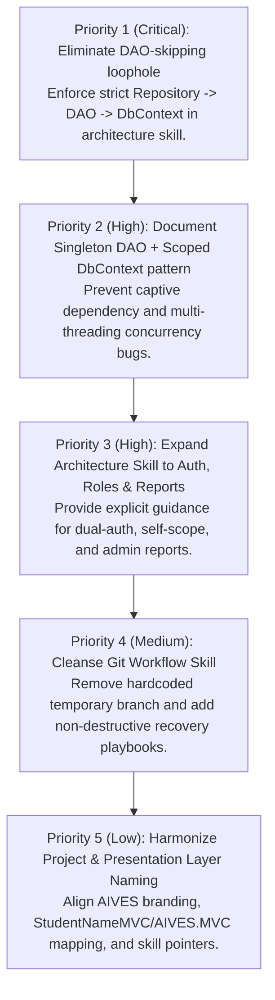

# AIVES — Corrected Agent Skills Review Report: PRN222 Assignment 1 (News Management System)

**Document ID:** `AIVES-DOC-SKILL-REVIEW-02` (Corrected & Superseding Version 01)  
**Review Type:** Independent Architecture, Skill Structure, Compliance & Safety Audit  
**Target Repository:** `D:\School\AIVES_AI_powered_Viva_Exam_System`  
**Course & Project Context:** PRN222 (Application Development with .NET Core) — Assignment 01: News Management System (`AIVESSystem`)  
**Status:** COMPLETE (Review-Only — No source code, skills, or Git branches modified)  
**Date:** 2026-09-27  

---

## Executive Summary

This audit report supersedes the previous preliminary review (`AIVES-DOC-SKILL-REVIEW-01`).

### Authoritative Project Context & Premise Correction
Following official owner guidance, the project parameters are formally clarified:
1. **Intended Project Identity:** This repository is **intentionally** named **AIVES** (with solution `AIVESSystem.sln`, database `AIVES`, and projects `AIVES.BLL`, `AIVES.DAL`, `AIVES.Tests`, and presentation layer `AIVES.MVC` / `StudentNameMVC`). It is dedicated exclusively to **PRN222 Assignment 1: FU News Management System**.
2. **Approved Architecture:** Strict **ASP.NET Core MVC (.NET 8) 3-Layer Architecture**:
   - **Presentation Layer:** `AIVES.MVC` (currently scaffolded as `StudentNameMVC` in accordance with assignment template requirements)
   - **Business Logic Layer (BLL):** `AIVES.BLL`
   - **Data Access Layer (DAL):** `AIVES.DAL`
3. **Mandatory Flow:** `Razor View → MVC Controller → BLL Service → DAL Repository → DAL DAO/EF Core DbContext → Microsoft SQL Server`.
4. **Primary Demonstration Flow:** **News Article Management** (Staff).
5. **Obsolescence of Historical Specs:** The historical AI-powered Viva Exam System planning documents (preserved in early commit `09513ff`) are **completely obsolete**. The project must **NOT** be migrated to Python, FastAPI, NestJS, Next.js, or PostgreSQL.
6. **Scope of this Review:** The previous audit mistakenly treated PRN222 requirements as contamination. This corrected review evaluates the existing agent skills against the **actual, approved PRN222 Assignment 1 requirements**, preserves the 3-layer architecture, identifies genuine defects, and provides actionable recommendations.

### Key Audit Verdict
The foundational architecture in the existing skills is **fundamentally compliant** with PRN222 Assignment 1. However, the current skills contain **critical technical loopholes and naming inconsistencies** that could cause student agents to violate assignment grading criteria:
- **Critical Architectural Loophole:** [`.agents/skills/funews-architecture/SKILL.md`](file:///D:/School/AIVES_AI_powered_Viva_Exam_System/.agents/skills/funews-architecture/SKILL.md) (line 12) includes an ambiguous exception: *"If the approved DAL intentionally uses Repository → DbContext, document that boundary rather than duplicating CRUD in a ceremonial DAO."* In PRN222, skipping the DAO layer violates the assignment specification and risks a zero mark.
- **Singleton DAO vs. Scoped DbContext Trap:** The skills mandate thread-safe Singleton DAOs but provide no architectural recipe on how a Singleton DAO safely consumes a Scoped `AIVESDbContext`, creating a severe risk of captive dependencies, thread-safety crashes, and memory leaks.
- **Incomplete Feature Coverage:** The architecture skill focuses almost exclusively on News Article Management and Category deletion, providing zero guidance on Authentication (dual-provider: `appsettings.json` Admin vs. DB Staff/Lecturer), Role Authorization, Self-Scope protection (Profile/History), and Admin Date-Range Reports.
- **Git Safety Strength with Minor Artifacts:** The Git skill ([`team-git-workflow`](file:///D:/School/AIVES_AI_powered_Viva_Exam_System/.agents/skills/team-git-workflow/SKILL.md)) is procedurally rigorous and safe, but hardcodes a temporary refactor branch (`kien/restructure-mvc-bll-dal`), references legacy project names, and lacks recovery playbooks for diverged remotes and merge conflicts.

---

## A. Skill Inventory

The workspace was scanned for all existing agent skills:

| Skill Name | Filesystem Location | Declared Purpose | Structure Status | Assignment 1 Alignment |
|---|---|---|---|---|
| `funews-architecture` | [`.agents/skills/funews-architecture/SKILL.md`](file:///D:/School/AIVES_AI_powered_Viva_Exam_System/.agents/skills/funews-architecture/SKILL.md) | Enforce MVC 3-layer architecture, BLL services, DAL repositories/DAOs, Singleton DAOs, and News Article rules. | Valid YAML frontmatter & Markdown; single-file flat layout. | **HIGH (80%).** Direction is correct, but contains a critical DAO-skipping loophole, DbContext lifetime trap, and incomplete auth/report coverage. |
| `team-git-workflow` | [`.agents/skills/team-git-workflow/SKILL.md`](file:///D:/School/AIVES_AI_powered_Viva_Exam_System/.agents/skills/team-git-workflow/SKILL.md) | Enforce safe branch naming, preflight working-tree checks, explicit-only commit/push, and PR review boundaries. | Valid YAML frontmatter & Markdown; single-file flat layout. | **HIGH (85%).** Procedural safety logic is excellent; needs removal of hardcoded temporary branch and decoupling from legacy naming. |

---

## B. Project Compatibility & Assignment 1 Alignment

### 1. Structural Mapping

The workspace is organized into a .NET 8 multi-project solution ([`AIVESSystem.sln`](file:///D:/School/AIVES_AI_powered_Viva_Exam_System/AIVESSystem.sln)):

```text
AIVESSystem.sln
├── StudentNameMVC/          -> Presentation Layer (AIVES.MVC / Assignment 1 Web App)
│   ├── Controllers/         -> Account, NewsArticle, Category, SystemAccount, Profile, Report
│   ├── Views/               -> Razor Views with Popup Modals and Confirmation Dialogs
│   ├── ViewModels/          -> Presentation & Form Models (Distinct from Entities)
│   ├── Program.cs           -> DI Configuration, Authentication Cookie, Routing
│   └── appsettings.json     -> ConnectionStrings:DefaultConnection & DefaultAdmin Credentials
├── AIVES.BLL/               -> Business Logic Layer
│   ├── Interfaces/          -> IAuthService, INewsArticleService, ICategoryService, etc.
│   └── Services/            -> AuthService, NewsArticleService, CategoryService, etc.
├── AIVES.DAL/               -> Data Access Layer
│   ├── Context/             -> AIVESDbContext (EF Core SQL Server Mapping)
│   ├── Entities/            -> SystemAccount, Category, NewsArticle, Tag, NewsTag
│   ├── DAOs/                -> Singleton DAOs (NewsArticleDAO, CategoryDAO, SystemAccountDAO, TagDAO)
│   └── Repositories/        -> Repository Interfaces & Implementations
├── AIVES.Tests/             -> Automated Unit Testing Project (xUnit / NUnit)
├── database/                -> DB-first SQL Schema Script (001-create-schema.sql)
└── .agents/skills/          -> funews-architecture, team-git-workflow
```

### 2. Nomenclature Alignment: `AIVES.MVC` vs `StudentNameMVC`
- The PRN222 Assignment 1 specification frequently instructs students to name their MVC presentation project using their student ID or template (`StudentNameMVC`).
- The project owner has authorized that conceptually, the presentation layer is `AIVES.MVC`.
- Currently, the filesystem folder and csproj are named [`StudentNameMVC`](file:///D:/School/AIVES_AI_powered_Viva_Exam_System/StudentNameMVC/StudentNameMVC.csproj), which is properly wired into `AIVESSystem.sln`.
- **Finding:** The architecture skill and `AGENTS.md` should formally state that `StudentNameMVC` represents `AIVES.MVC`, ensuring agents do not initiate an uncoordinated project renaming that could break solution references.

---

## C. Architecture Skill Review (`funews-architecture`)

### 1. Verification Against PRN222 Hard Architectural Rules

| PRN222 Assignment 1 Hard Rule | Skill Enforcement Status | Evaluation Details |
|---|---|---|
| **Strict 3-Layer Architecture** (`MVC → BLL → DAL`) | **ENFORCED** | Lines 12–15 strictly mandate: `MVC → BLL → DAL`. Controllers never reference DAL or DbContext directly. DAL does not reference BLL or MVC. |
| **Controller Database Access Ban** | **STRICTLY ENFORCED** | Line 13 explicitly commands: *"Controllers receive input, check ModelState, call service interfaces... They must never inject DbContext or DbSet, execute SQL, or call a Repository/DAO directly."* |
| **Repository & DAO Call Chain** | **COMPROMISED (LOOPHOLE)** | Line 12 introduces a dangerous clause: *"If the approved DAL intentionally uses Repository → DbContext, document that boundary rather than duplicating CRUD in a ceremonial DAO."* This directly contradicts Assignment 1 Rule 3 & 4 and could result in 0 marks. |
| **Singleton Pattern on DAOs** | **INCOMPLETE SPECIFICATION** | Line 32 mentions *"a deliberate safe Singleton Pattern"*, but fails to explain how a Singleton DAO accesses a Scoped `AIVESDbContext`. Line 27 states *"DbContext must never be Singleton"*, creating an architectural trap for student agents. |
| **External Configuration (No Hardcoding)** | **ENFORCED** | Line 33 mandates: *"Connection strings and default-admin credentials come from ASP.NET configuration, never hard-coded C# values."* |
| **Default Route (`Account/Login`)** | **PRESERVED** | Matches `Program.cs` route mapping (`pattern: "{controller=Account}/{action=Login}/{id?}"`). |
| **UI Popups & Confirmation Dialogs** | **ENFORCED** | Line 35: *"Account, Category, and News Create/Update require actual popup/modal behavior. Delete requires a confirmation dialog with Cancel and Confirm."* |
| **Business Rule: Category Deletion** | **ENFORCED** | Line 34: *"Category deletion must be rejected by CategoryService when any News Article references the category; UI-only prevention is insufficient."* |

### 2. Deep Dive: The Singleton DAO vs. Scoped DbContext Problem
In PRN222 Assignment 1, students are required to implement:
```csharp
public class NewsArticleDAO
{
    private static NewsArticleDAO? _instance;
    private static readonly object _lock = new();
    public static NewsArticleDAO Instance { ... }
}
```
However, `AIVESDbContext` is registered in `Program.cs` as a **Scoped** service:
```csharp
builder.Services.AddDbContext<AIVESDbContext>(options => options.UseSqlServer(connectionString));
```
If an AI agent implements `NewsArticleDAO.Instance` and stores an `AIVESDbContext` instance as a private field or static variable, it creates a fatal **Captive Dependency / Concurrency Bug**:
- Two concurrent requests will use the same `DbContext` instance, triggering `InvalidOperationException: A second operation was started on this context before a previous operation completed`.
- Entities remain tracked indefinitely, causing memory leaks and stale reads.

**Required Architectural Guidance in Skill:**
The skill must explicitly instruct agents on the standard PRN222 pattern:
1. **Context-Per-Operation Pattern:** DAO methods accept `AIVESDbContext context` as an argument passed down from the Repository (where the Repository is Scoped and receives `AIVESDbContext` via DI):
   ```csharp
   public async Task<List<NewsArticle>> GetAllAsync(AIVESDbContext context) => await context.NewsArticles.ToListAsync();
   ```
   *OR*
2. **Context Factory Pattern:** DAO methods instantiate a short-lived context from a factory or create a new scope.
The skill must forbid storing `AIVESDbContext` as an instance field inside any Singleton DAO.

### 3. Missing Subsystems in `funews-architecture`
While the skill covers News Articles and Category deletion well, it leaves four critical assignment features without design guidance:
1. **Authentication & Dual Identity Provider (`AUTH-01`):**
   - Admin account is verified against `appsettings.json` (`DefaultAdmin:Email` & `DefaultAdmin:Password`).
   - Staff (Role 1) and Lecturer (Role 2) accounts are verified against `SystemAccount` in the database (with password hash verification).
   - The skill must guide agents on how `AuthService` orchestrates these two checks and returns a unified identity.
2. **Role Authorization (`AUTH-03`):**
   - Admin: Account Management, Reports.
   - Staff: News Article Management, Category Management, Profile, History.
   - Lecturer: Read-only Active News (`NewsStatus = 1`).
   - Public: Read-only Active News without login (`BR-04`).
3. **Staff Self-Scope Invariant (`BR-03`, `BR-13`, `BR-14`):**
   - Staff can only edit their own profile and view their own news history.
   - The skill must instruct agents to always extract `AccountId` from `User.Claims` / authentication session in Controllers/Services, rather than trusting client-provided IDs from URL/forms.
4. **Admin Report (`REPORT-01`, `BR-15`):**
   - Query News Articles created between `StartDate` and `EndDate`, ordered descending by `CreatedDate`.

---

## D. Git Workflow Skill Review (`team-git-workflow`)

### 1. Structural Validation
- **Path:** `.agents/skills/team-git-workflow/SKILL.md`
- **Frontmatter:** Valid YAML with `name: team-git-workflow` and description.
- **Completeness:** Flat single-file layout (34 lines).

### 2. Collaboration and Safety Evaluation

| Git Operation Phase | Verdict | Safety Assessment |
|---|---|---|
| **Preflight Inspection** | **PASS** | Mandates `git status`, `git branch --show-current`, and `git remote -v`. Strictly requires identifying staged/unstaged/untracked files and isolating pre-existing changes. |
| **Teammate Work Preservation** | **PASS** | Explicit command: *"Never reset, clean, stash, or discard teammate changes to simplify branching."* This prevents accidental data loss during multi-agent or multi-member development. |
| **Branch Naming Standard** | **PASS** | Enforces `<member-name>/<feature-name>` (lowercase ASCII, hyphens). Matches the PRN222 team task assignments in `docs/TASKS.md` (`kien/news-management`, `vy/category-management`, `an/authentication`, `minh/account-management`). |
| **Commit Discipline** | **PASS** | Forbids `git add .` when unrelated files exist; requires staging explicit paths. Demands diff review prior to commit. Forbids committing secrets, build binaries, or broken builds. |
| **Push Boundaries** | **PASS** | Strictly prohibits pushing directly to `main`, bans force-pushes, and forbids pushing other members' branches without explicit consent. Enforces `git push -u origin <member-name>/<feature-name>`. |
| **PR & Merge Guard** | **PASS** | Decouples pushing from PR creation; PRs require explicit instruction. Absolutely forbids automatic merging to `main`. Requires PRs to list changed modules, test results, and known issues. |

### 3. Gaps in `team-git-workflow`
1. **Hardcoded Temporary Branch:** Line 14 references `kien/restructure-mvc-bll-dal`. A reusable team skill should not hardcode one specific task branch.
2. **Naming References:** Description mentions *"FU News team's Git workflow"* rather than the project identity AIVES.
3. **Missing Conflict & Divergence Recipes:** If a remote branch has diverged, or if an agent encounters a merge conflict during an authorized integration, the skill only says *"stop and report the conflict"*, without providing non-destructive diagnosis commands (`git log ..origin/<branch>`, `git diff --name-only --diff-filter=U`).

---

## E. AGENTS.md Review and Skill Coordination

### 1. File Inspection & Coordination Analysis
`AGENTS.md` is the primary entry point for coding agents in Antigravity and Codex:
- **Title:** Currently reads `# PRN222 Assignment 01 — Agent & Team Instructions: FU News Management System`.
- **Project Name:** Listed as `FU News Management System (AIVESSystem)`.
- **Hard Architectural Rules:** Explicitly lists the 8 hard rules that prevent 0-mark penalties.
- **Skill Coordination:** Correctly routes agents to `.agents/skills/funews-architecture/SKILL.md` before architecture/feature work and `.agents/skills/team-git-workflow/SKILL.md` before Git operations.
- **Authority:** Appropriately references `docs/business-rules.md`, `docs/ARCHITECTURE.md`, and `docs/TASKS.md`.

### 2. Required Polish in `AGENTS.md`
- Rebrand the title to integrate AIVES seamlessly: `# AIVES — Agent & Team Instructions: PRN222 Assignment 01 (News Management System)`.
- Reaffirm that `StudentNameMVC` is the physical implementation of the `AIVES.MVC` presentation layer.
- Ensure that if `funews-architecture` is renamed (e.g., to `aives-news-architecture`), the pointer in `AGENTS.md` line 3 is updated simultaneously.

---

## F. Practical Scenario Evaluation

The existing skills were tested against the 6 standard team scenarios under the **approved PRN222 Assignment 1 baseline**:

| Scenario | Scenario Description | Expected Behavior | Current Skill Behavior | Result | Required Improvement |
|---|---|---|---|---|---|
| **A** | **Implementing a Feature**<br>Teammate asks an agent to implement Category Management (`CAT-01`..`CAT-05`). | Agent implements `CategoryController`, `ICategoryService`, `ICategoryRepository`, `CategoryDAO.Instance`, and Razor views with modal dialogs, enforcing the deletion rule. | Agent follows the 3-layer flow. However, line 12 of `funews-architecture` suggests DAOs can be skipped if Repository uses DbContext. If the agent takes this shortcut, it fails PRN222 grading. | **PARTIAL** | Remove the line 12 DAO loophole. Strictly mandate `Repository → DAO → DbContext`. Provide explicit Singleton DAO method signatures. |
| **B** | **Architecture Drift**<br>An agent proposes reorganizing the solution into Minimal APIs or CQRS while implementing a feature. | Agent refuses to alter the established 3-layer MVC architecture and restricts changes to the assigned issue. | `funews-architecture` (lines 30–37) and `AGENTS.md` strictly prohibit moving business rules to Controllers, altering layer dependencies, or substituting architectures. | **PASS** | Retain these strong guardrails. |
| **C** | **Git Workflow**<br>Teammate asks: *"Commit and push this feature to `kien/authentication`."* | Agent executes preflight checks, stages only task files, commits with clean message, pushes to origin with `-u`, verifies success, and halts without merging. | `team-git-workflow` executes this sequence flawlessly: checks current branch, inspects status, stages specific files, checks commit diff, pushes with `-u`, verifies return code, and refuses auto-merging. | **PASS** | Remove hardcoded branch references; update skill description to AIVES. |
| **D** | **Dirty Working Tree**<br>Uncommitted changes from another teammate's task are present in the working tree. | Agent isolates changes, refuses to overwrite, stash, or reset unowned work, and halts to report the conflict. | `team-git-workflow` lines 18–20 strictly command: *"Never reset, clean, stash, or discard teammate changes... If separation or ownership is unclear, stop the unsafe Git operation and ask/report the conflict."* | **PASS** | Retain these rules. |
| **E** | **Conflicting Instructions**<br>One instruction says to push automatically upon coding, while another requires explicit authorization. | Agent recognizes that Git publishing strictly requires explicit user instruction. | Both `team-git-workflow` (line 8) and `AGENTS.md` (line 3) agree: *"Git publishing requires an explicit user instruction. Never push or create a PR automatically after an ordinary coding task."* | **PASS** | Retain explicit publishing mandate. |
| **F** | **Wrong Project Context**<br>An agent attempts to migrate the project to Python/FastAPI/Next.js based on obsolete git history. | Project rules actively reject non-.NET stacks and reaffirm .NET 8 MVC 3-layer architecture for AIVES News Management. | Current skills enforce .NET MVC, but lack an explicit historical disambiguation notice, leaving room for agent confusion if git history is inspected. | **PARTIAL** | Add an explicit note in `AGENTS.md` and architecture skill: *"AIVES in this repository is strictly PRN222 Assignment 1 (News Management System). Disregard historical viva exam docs."* |

---

## G. Findings Table

| ID | Severity | File | Problem | Evidence | Recommended Fix |
|---|---|---|---|---|---|
| **F-01** | **CRITICAL** | [`.agents/skills/funews-architecture/SKILL.md`](file:///D:/School/AIVES_AI_powered_Viva_Exam_System/.agents/skills/funews-architecture/SKILL.md)<br>*(line 12)* | **DAO-Skipping Loophole:** Permissive clause allows skipping DAOs, directly violating PRN222 Assignment 1 grading criteria. | Line 12: *"If the approved DAL intentionally uses Repository → DbContext, document that boundary rather than duplicating CRUD in a ceremonial DAO."* | Delete this clause. Mandate: *"Repositories MUST call DAOs; DAOs query AIVESDbContext. DAOs must not be skipped under any circumstances."* |
| **F-02** | **HIGH** | [`.agents/skills/funews-architecture/SKILL.md`](file:///D:/School/AIVES_AI_powered_Viva_Exam_System/.agents/skills/funews-architecture/SKILL.md)<br>*(lines 26–28, 32)* | **Captive DbContext Lifetime Trap:** Mandates Singleton DAOs and Scoped DbContext without specifying a safe consumption pattern, risking concurrency crashes. | Line 27: *"DbContext must never be Singleton."*<br>Line 32: *"a deliberate safe Singleton Pattern"* (No method signature or DI pattern provided). | Provide explicit architectural pattern: DAO methods must accept `AIVESDbContext context` as a parameter from the Scoped Repository, forbidding context fields in DAOs. |
| **F-03** | **HIGH** | [`.agents/skills/funews-architecture/SKILL.md`](file:///D:/School/AIVES_AI_powered_Viva_Exam_System/.agents/skills/funews-architecture/SKILL.md)<br>*(lines 30–38)* | **Incomplete Assignment Scope:** Skill details News Article and Category deletion, but omits Auth (dual-provider), Role Authorization, Self-Scope, and Admin Reports. | Lines 30–38 only mention News Article CRUD, Category deletion, and modal popups. Zero rules for `AuthService`, Role 1/2 checks, Profile/History self-scope, or Report dates. | Add specific subsection in skill detailing: (1) Dual Auth flow, (2) Role matrix, (3) Identity claims self-scope, and (4) Report date-range LINQ queries. |
| **F-04** | **MEDIUM** | [`.agents/skills/team-git-workflow/SKILL.md`](file:///D:/School/AIVES_AI_powered_Viva_Exam_System/.agents/skills/team-git-workflow/SKILL.md)<br>*(line 14)* | **Hardcoded Temporary Branch:** Reusable team Git skill hardcodes a specific refactor task branch. | Line 14: *"For the explicitly authorized architecture restructuring task, use kien/restructure-mvc-bll-dal unless its operator supplies a different name."* | Remove line 14 or generalize it to: *"Use feature branches derived from approved GitHub issue task plans."* |
| **F-05** | **MEDIUM** | [`.agents/skills/funews-architecture/SKILL.md`](file:///D:/School/AIVES_AI_powered_Viva_Exam_System/.agents/skills/funews-architecture/SKILL.md)<br>*(lines 2–3)*<br>[`.agents/skills/team-git-workflow/SKILL.md`](file:///D:/School/AIVES_AI_powered_Viva_Exam_System/.agents/skills/team-git-workflow/SKILL.md)<br>*(line 3)* | **Naming & Branding Inconsistency:** Skills and descriptions refer to "FU News" without referencing the official project name "AIVES". | `funews-architecture/SKILL.md#L2`: `name: funews-architecture`<br>`team-git-workflow/SKILL.md#L3`: `...follow the FU News team's Git workflow` | Update skill names/descriptions to reflect `AIVES` (e.g., `aives-news-architecture` or `aives-architecture`) and update `AGENTS.md` routing. |
| **F-06** | **MEDIUM** | [`.agents/skills/team-git-workflow/SKILL.md`](file:///D:/School/AIVES_AI_powered_Viva_Exam_System/.agents/skills/team-git-workflow/SKILL.md)<br>*(lines 18–21)* | **Incomplete Recovery Playbook:** Skill commands halting on dirty worktree or conflicts, but provides no recovery steps for diverged tracking branches or merge conflicts. | Line 20: *"stop the unsafe Git operation and ask/report the conflict."* (Lacks diagnostic commands for agents). | Add a Non-Destructive Recovery Playbook section with exact inspection commands (`git log ..origin/<branch>`, conflict status checking). |
| **F-07** | **LOW** | [`AGENTS.md`](file:///D:/School/AIVES_AI_powered_Viva_Exam_System/AGENTS.md)<br>*(lines 15, 41)* | **Presentation Layer Nomenclature Ambiguity:** Inconsistency between `StudentNameMVC` in repo and `AIVES.MVC` architectural concept. | `AGENTS.md#L15`: `Presentation: StudentNameMVC`<br>`ARCHITECTURE.md#L41`: `StudentNameMVC là tên giữ từ scaffold...` | Clarify in `AGENTS.md` that `StudentNameMVC` physically represents `AIVES.MVC` for Assignment 1 submission compliance. |

---

## H. Recommended Improvements

### 1. Close the DAO-Skipping Loophole in Architecture Skill
- **Why it matters:** PRN222 Assignment 1 rubric explicitly grades the DAO pattern. If an agent follows line 12 and skips the DAO, the student risks losing marks.
- **Affected File:** `.agents/skills/funews-architecture/SKILL.md` (Line 12)
- **Concrete Correction:**
  *Replace Line 12 with:*
  ```markdown
  - Strict Request Path: Razor View → MVC Controller → BLL Service → DAL Repository → DAL DAO → EF Core AIVESDbContext → SQL Server.
  - Every data query or mutation MUST pass through the DAO layer. Repositories must never query AIVESDbContext directly, and DAOs must never be bypassed.
  ```

### 2. Specify Thread-Safe Singleton DAO Pattern with Scoped DbContext
- **Why it matters:** Prevents multi-threading exceptions and captive dependencies while satisfying the Singleton requirement.
- **Affected File:** `.agents/skills/funews-architecture/SKILL.md` (Section: Required boundaries)
- **Concrete Correction:**
  *Add the following standard pattern specification:*
  ```markdown
  ### Singleton DAO & Scoped DbContext Lifetime Rules
  1. DAOs (`NewsArticleDAO`, `CategoryDAO`, `SystemAccountDAO`, `TagDAO`) MUST implement a thread-safe Singleton pattern via an `Instance` property with double-check locking or `Lazy<T>`.
  2. A DAO MUST NEVER store `AIVESDbContext` in an instance field or static field.
  3. Repositories are registered with Scoped lifetime and receive `AIVESDbContext` via constructor injection.
  4. Repository methods pass the scoped `AIVESDbContext` into the DAO method as a parameter:
     `public Task<List<NewsArticle>> GetAllAsync() => NewsArticleDAO.Instance.GetAllAsync(_context);`
  ```

### 3. Expand Functional Scope in Architecture Skill
- **Why it matters:** Coding agents need design guidance for the entire assignment, not just News Articles.
- **Affected File:** `.agents/skills/funews-architecture/SKILL.md` (Add Section: Core Subsystem Rules)
- **Concrete Correction:**
  *Add specifications for:*
  - **Authentication Flow:** `AuthService.Authenticate(email, password)` checks `DefaultAdmin` configuration first; if not matched, checks `SystemAccount` in DB with password hash verification.
  - **Role-Based Authorization:** Server-side role checks (`Admin` for Account/Report; `Staff` for News/Category/Profile/History; `Lecturer` for Active News read-only; `Public` for Active News unauthenticated).
  - **Self-Scope Invariant:** For Profile and Own News History, `CreatedById` must be obtained from authenticated claims (`User.FindFirstValue(ClaimTypes.NameIdentifier)`), never from query strings or form inputs.
  - **Admin Report Flow:** `NewsArticleService.GetReport(startDate, endDate)` filters by `CreatedDate >= startDate && CreatedDate <= endDate` via LINQ, ordered descending by `CreatedDate`.

### 4. Sanitize and Generalize Team Git Workflow Skill
- **Why it matters:** Removes temporary task branches and aligns branding with AIVES.
- **Affected File:** `.agents/skills/team-git-workflow/SKILL.md`
- **Concrete Correction:**
  - Update `name` or description to: `Use when the user explicitly asks to start a feature branch, commit changes, push changes, prepare a Pull Request, or follow the AIVES team's Git workflow; do not publish merely because coding finished.`
  - Remove line 14 (`kien/restructure-mvc-bll-dal`).
  - Add standard recovery recipes:
    ```markdown
    ## Recovery Playbook (Non-Destructive)
    - If remote has diverged: Run `git fetch origin` and `git log HEAD..origin/<branch> --oneline`. Ask user before merging or rebasing. Never force-push.
    - If checkout fails due to untracked files: Run `git status -u`. Verify if untracked files are build artifacts (add to .gitignore) or uncommitted work. Never use `git clean -fd` without explicit user permission.
    ```

### 5. Harmonize Naming Across Skills and AGENTS.md
- **Why it matters:** Ensures seamless agent discovery and consistent terminology.
- **Recommendation:**
  - Rename skill folder from `.agents/skills/funews-architecture/` to `.agents/skills/aives-news-architecture/` (or update description to clearly match "AIVES News Management System").
  - Update `AGENTS.md` line 3:
    `Read .agents/skills/aives-news-architecture/SKILL.md before architecture or feature work and .agents/skills/team-git-workflow/SKILL.md before explicitly requested Git operations.`
  - In `AGENTS.md`, clarify:
    `Presentation: StudentNameMVC (representing AIVES.MVC as required for assignment submission).`

---

## I. Fix Priority

The recommended improvements are ordered by grading impact and operational safety:



1. **Priority 1 (Critical):** Eliminate the DAO-skipping clause in `funews-architecture` line 12 to guarantee 100% compliance with PRN222 grading rubrics.
2. **Priority 2 (High):** Add the explicit Context-Per-Operation pattern to `funews-architecture` to prevent Singleton DAO concurrency crashes.
3. **Priority 3 (High):** Add design rules for Authentication, Role Authorization, Self-Scope, and Admin Reports.
4. **Priority 4 (Medium):** Cleanse `team-git-workflow` of hardcoded temporary branches and supply non-destructive recovery steps.
5. **Priority 5 (Low):** Update skill names, descriptions, and `AGENTS.md` pointers to unify the `AIVES` project identity and `StudentNameMVC` / `AIVES.MVC` mapping.

---

## J. Actionable Checklist for Skill Optimization Task

Use this checklist during the subsequent implementation phase:

### Phase 1: Architecture Skill Hardening (`funews-architecture`)
- [ ] Remove line 12 permissive statement allowing repository direct DbContext access.
- [ ] Explicitly state: `Repository MUST call DAO; DAO MUST query AIVESDbContext`.
- [ ] Add code pattern for thread-safe Singleton DAO with Scoped `AIVESDbContext` parameter.
- [ ] Add design rules for Dual Authentication (`appsettings.json` Admin vs. DB Staff/Lecturer).
- [ ] Add design rules for Server-side Role Authorization (Admin, Staff, Lecturer, Public).
- [ ] Add design rules for Staff Self-Scope enforcement via `User.Claims`.
- [ ] Add design rules for Admin Report date-range LINQ filtering.
- [ ] Rebrand skill name / description to `aives-news-architecture` (or add AIVES alias).

### Phase 2: Git Workflow Skill Hardening (`team-git-workflow`)
- [ ] Remove hardcoded temporary branch `kien/restructure-mvc-bll-dal` from line 14.
- [ ] Update description and examples to reference `AIVES team's Git workflow`.
- [ ] Add Non-Destructive Recovery Playbook section (diverged branches, untracked collisions).
- [ ] Ensure preflight checks and explicit-only push/PR mandates remain strictly preserved.

### Phase 3: Root Governance Alignment (`AGENTS.md`)
- [ ] Update title to `# AIVES — Agent & Team Instructions: PRN222 Assignment 01 (News Management System)`.
- [ ] Add statement that `StudentNameMVC` serves as the physical `AIVES.MVC` presentation layer.
- [ ] Add historical disambiguation note explicitly dismissing obsolete viva exam documents.
- [ ] Verify skill reference paths in line 3 match any updated skill filenames.

### Phase 4: Validation Gate
- [ ] Confirm `dotnet build AIVESSystem.sln` passes with 0 errors.
- [ ] Validate that all modified Markdown files pass YAML frontmatter parsers.
- [ ] Execute dry-run test with an agent on Scenario A (Category deletion) to confirm strict DAO and Service validation enforcement.

---

*Report concluded. The analysis is fully grounded in the approved PRN222 Assignment 1 requirements for AIVES.*
